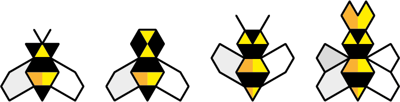

<!--### TODO

- [x] Tech? No tech
- [x] Can you trade tech for bees? Nope.
- [x] How many bees do you start with?
- [ ] We also have beeswax, pesticides, sting, pollen, nectar..
- [x] *Nectar cards*? Nectar and pollen are bees' food. In literal terms, these would be *extraction power* cards. We could have one nectar card which gives you *competitive advantage*: the right to start a turn. But it's a bit of a gimmick.
- [x] Queen - worker - drones
- [ ] scarce harvest?
- [ ] colonial cards or just cards?
- [ ]Different types of flowers?
- [ ] What happens when there are no flowers left? Declare a winner, everybody loses, something else?
- [ ] Bankruptcy?
- [ ] Artist bees to keep the colony happy
- [ ] Convert drones into useful bees?
- [ ] Benefit bees -> drones after 2-3 attacks
- [ ] Print honey notes?
- [ ] Event cards?
- [ ] Roll the die to determine the replenishing factor?
-->

# Beesness

### A playable simulation of a *capitalist market economy* 

As a player, you control a **bee colony**. 

These are special bees. They have learned how to do *beesness* from us humans. 

Every colony operates in the **garden of Commons**.

Throughout the game, you can deploy different *beesness models*: from **trading** flowers for honey, to **extorting** honey from other colonies, **privatising** flowers and other nasty moves..

### Your goal

To have the most *honey* at the end of the year!

#### End game scenarios

1. At the end of the year (12 turns), the colony with the **most honey wins**, provided there are still flowers left in the *garden*.
* If all flowers are taken from the garden, at any point during the game, **everybody loses**.

## Setup

### How many players? 

From **2** to **infinity**. 

### The garden of Commons

Plant **flowers** in the garden. To start with, place 5 flower tokens for each player on the table.

Players			| Flowers
------ 			| -------
2  				| 10
3  				| 15
4  				| 20
5  				| 25
6  				| 30
etc.  			| The formula: 5 × players

### Meet the bees

Place the **bee cards** face up, stacked by bee type (4 stacks).

Type | Price honey	| Skills
---- | ----------------	| ------
**Worker** bee   | **4** | It can **take 1 flower per month**  **if** the garden has more than half of the starting flowers   (eg: `if flowers > 10` when there are 4 players) 
**Austerity** bee   | **8** | It can **take 1 flower per month**  (no matter what)
**Drone** bee   | **8** | It can **take 2 honey per month**  from another colony
**Queen**   | **16** | It can **generate 1 bee per month**  OR  **privatise 1 flower per month**  (you'll learn what these mean later)

### The colony

Each player starts with **1 worker bee**.
 
### The honey pot bank 
 
Put all the **honey** in one pot (or pile). That will be the **bank**. 

### The calendar 

Put a **month marker** (any token) on the first month of the year.

## Gameplay

### Who starts the round?
	
This is optional (and it doesn't matter who starts the very first round) but starting a round may give you a competitive advantage in times of *austerity*... 
	
You can determine the player who starts a round by **bidding honey**. The highest bidder pays the bank and gets the right to execute their *beesness strategy* before all other players. 
	
Play then proceeds *clockwise*.

If you wish, you can do this at the beginning of every round.

### There are three steps to every round

1. One player at a time, you [execute your *beesness strategy*](#1-execute-your-beesness-strategy)
2. All together, you [sell your flowers for honey](#2-sell-your-flowers-for-honey)
3. All together, you [replant the garden](#3-replant-the-garden)

### 1. Execute your beesness strategy!

If you have honey, you can decide to invest some (or all) of it to **grow your colony**. You are allowed to buy one bee card per turn. Pay the bank and add the card to your colony.  

Then use as many of your cards as you wish to execute your strategy. 
	
**For example**
	
IF	| AND | THEN
-------	| --- | ----
you have 2 *worker bees* | there are **more than half** of the initial number of flowers in the *garden of Commons* | you can take 2 flowers
you want to use a *worker bee* to take flowers | there are **half or less than half** of the initial number of flowers in the *garden of Commons* | you cannot take flowers with that card
you have 1 *drone* |  | you can take 2 honey from another colony
you want to deploy *drones* against another player | they have less honey than you could take | you can force them to use one or more of their bee cards as *payment* (eg: put a *worker bee* back to the stack, get 4 honey from the bank and pay you) 	
you have a *queen* |  | you can either **generate** another bee of your choice (that is, pick another card from the stack, any card but not another queen) or **privatise** a flower (that is, keep it in your colony, [more details on this below](#privatise)). You cannot both generate and privatise in the same turn.

### 2. Sell your flowers for honey!

After all players have executed their strategies, determine the **price of one flower** for this *month*. 	

	
**Total** flowers  | 2 players | 3 players | 4 players | 5 players | 6 players 
----------------- | --------- | --------- | --------- | --------- | ---------
 2 | 3 | 3 | 3 | 3 | 3
 3 | 3 | 3 | 3 | 3 | 3
 4 | 2 | 3 | 3 | 3 | 3
 5 | 2 | 3 | 3 | 3 | 3
 6 | 2 | 2 | 3 | 3 | 3
 7 | 2 | 2 | 3 | 3 | 3
 8 | 2 | 2 | 2 | 3 | 3
 9 | 1 | 2 | 2 | 3 | 3
10 | 1 | 2 | 2 | 2 | 3
11 | 1 | 2 | 2 | 2 | 3
12 | 1 | 2 | 2 | 2 | 2
13 | 1 | 1 | 2 | 2 | 2
14 | 1 | 1 | 2 | 2 | 2
15 | 1 | 1 | 2 | 2 | 2 
16 | 1 | 1 | 1 | 2 | 2
17 | 1 | 1 | 1 | 2 | 2
18 | 1 | 1 | 1 | 2 | 2
19 | 1 | 1 | 1 | 2 | 2
20 | 1 | 1 | 1 | 2 | 2
21 | 1 | 1 | 1 | 1 | 2
22 | 1 | 1 | 1 | 1 | 2
23 | 1 | 1 | 1 | 1 | 2
24 | 1 | 1 | 1 | 1 | 2
25 | 1 | 1 | 1 | 1 | 1  	

Each player gets paid in honey, from the bank, for the flowers they took this month. 
	
> For example: if you took 2 flowers and their individual value is 3, then you'll get 6 honey from the bank.
	
Your flowers are now sold. Discard them. 

#### Privatise

If you have a *queen* (and you haven't already used it this month to *generate* a bee), you can keep one flower per month and still get paid for it. From the next month, this **privatised** flower will generate more honey for you (at its current market value).

### 3. Replant the garden!

At the end of the round, add 1 flower for every 2 flowers left in the garden.

> For example: if there are 9 flowers left, add 4.

<!--
For each colony, add 1 flower to the garden.
> For example: if there are 4 players, add 4. 
-->

#### If flowers are running out... 

All together, you can decide to **give back** one or more of your bee cards in order to replenish the garden. 

Each *worker*, *austerity* and *drone* bee can get you 1 flower. The *queen* is worth 2 flowers.

You don't all have to give back the same number or type of cards. For example, one player may decide to give back 1 bee, and another player 3 bees. Discuss and try to reach a consensus. Remember, **if the garden runs out of flowers, everybody loses. **

#### End of the month

Move the month marker to the next space on the calendar to keep track of the rounds.

The game ends at the end of the last month. 

**The player with the most honey wins!**

<!--

### Unpacking the metaphors

Just in case you still think this is about *bees*.

Symbol			| Meaning
------ 			| -------
Colony  		| Private company / corporation
Flowers			| The Commons ideas, raw materials etc.
Honey			| Money
Turns			| Time
Worker bees		| Self-explanatory
Drones			| Military?
Queens			| Growth?
Nectar card		| Competitive advantage

#### What other metaphors can you think of?

Could you *re-skin* this game with a different set of symbols? 

How would that impact the meaning(s) produced during the gameplay?

-->

### License

This work is licensed under a [Creative Commons Attribution-NonCommercial-ShareAlike 4.0 International License](http://creativecommons.org/licenses/by-nc-sa/4.0)

