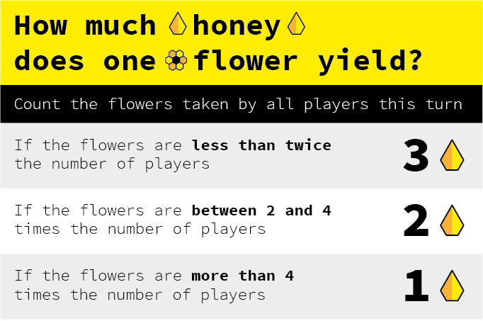

# Beesness

### A playable simulation of a *capitalist market economy* 

As a player, you control a **bee colony**. 

These are special bees. They have learned how to do *beesness* from us humans. 

Every colony operates in the **garden of Commons**.

Throughout the game, you can deploy different *beesness models*: from **trading** flowers for honey, to **extorting** honey from other colonies, **privatising** flowers and other nasty moves..

### Your goal

To have the most *honey* at the end of the year!

#### End game scenarios

1. At the end of the year (12 turns), the colony with the **most honey wins**, provided there are still flowers left in the *garden*.
* If all flowers are taken from the garden, at any point during the game, **everybody loses**.

## Ingredients

* 2+ [human players](#how-many-players)
* A [table](#the-garden-of-commons) 
* Flower tokens (roughly 10 for each player)
* [Honey tokens](#the-honey-pot-bank) 
* [Bee cards](#meet-the-bees)
* Flower - honey [price chart](#2-sell-your-flowers-for-honey)
* Turns tracker (aka the [calendar](#the-calendar))  

### How many players? 

From **2** to **infinity**. 

### The garden of Commons

Plant **flowers** in the garden. To start with, place 6 flower tokens for each player on the **table**.

Players	| Flowers
------ 	| -------
2       | 12
3       | 18
4       | 24
5       | 30
6       | 36
etc.    | The formula: 6 × players

### The honey pot bank 
 
Put all the **honey** in one pot (or pile). That will be the **bank**. 

### The colony

Each player starts with an initial capital of **12 honey**. 

### Meet the bees

Place the **bee cards** face up, stacked by bee type.

Type | Price honey	| Skills
---- | ----------------	| ------
**Worker** bee   | **6** | It can **take 1 flower per month** 
**Drone** bee   | **12** | It can **take 3 honey per month**  from another colony
**Queen** bee   | **18** | It can  **privatise 1 flower per month**  (you'll learn what these mean later)

### The calendar 

Put a **month marker** (any token) on the first month of the year.

## Method

### Who starts the round?

There are two ways to decide this:

1. By **bidding honey**, aka *beedding*. The highest *beedder* pays the bank and gets the right to execute their *beesness strategy* before all other players.
	
	If you wish, you can *beed* to start at the beginning of every round.
2. If nobody wants to *beed*, then you will rotate the starting player. If you started this round, the player to your left will start the next.

Play proceeds *clockwise*.

### There are three steps to every round

1. One player at a time, you [execute your *beesness strategy*](#1-execute-your-beesness-strategy)
2. All together, you [sell your flowers for honey](#2-sell-your-flowers-for-honey)
3. All together, you [replant the garden](#3-replant-the-garden)

### 1. Execute your beesness strategy!

#### Invest

If you have honey, you can decide to invest some (or all) of it to **grow your colony**. 

You can buy as many bee cards as you can afford. 

Pay the bank and add the card(s) to your colony.  

#### Deploy

Deploy as many of your cards as you wish. 

You can deploy newly acquired bees immediately (no need to wait for the next round).

> For example

> If you have 2 ***workers***, you can take 2 flowers.

> If you have 1 ***drone***, you can take 3 honey from another colony.

> If you want to deploy ***drones*** against another player but they have less honey than you could take, you can force them to use one or more of their bee cards as *payment* (eg: put a *worker bee* back to the stack, get 6 honey from the bank and pay you). 

> If you use **drones** to pillage another colony, you have to wait for your next turn to invest the loot.
 	
> If you have a **queen**, you can **privatise** a flower (that is, keep it in your colony, [more details on this below](#privatise)). 

#### Can I sell bees?

You are not allowed to make bees *redundant*, i.e. selling them back to the bank.

You can **trade bees with other players** though. See if anyone is interested in your bees and negotiate a price.

### 2. Sell your flowers for honey!

After all players have executed their strategies, determine the **price of one flower** for this *month*. 	

 
Each player gets paid in honey, from the bank, for the flowers they took this month. 
	
> For example: if you took 2 flowers and their individual value is 3, then you'll get 6 honey from the bank.
	
Your flowers are now sold. Discard them. 

#### Privatise

If you have a *queen*, you can keep one flower per month and still get paid for it. From the next month, this **privatised** flower will generate more honey for you at its current market value.

### 3. Replant the garden!

At the end of the round, **replant one flower per player**.

> For example: if there are 4 players, add 4 flowers to the *garden*.

#### If flowers are running out... 

All together, you can decide to **give back** one or more of your bee cards in order to replenish the garden. 

Each *worker* and *drone* bee can get you 1 flower. The *queen* is worth 2 flowers.

You don't all have to give back the same number or type of cards. For example, one player may decide to give back 1 bee, and another player 3 bees. Discuss and try to reach a consensus. Remember, **if the garden runs out of flowers, everybody loses.**

#### End of the month

Move the month marker to the next space on the calendar to keep track of the rounds.

### End of the game

The game ends at the end of the last month. 

**The player with the most honey wins!**

#### Does my bees arsenal count at the end of the game?

No. It's just the honey you have (that is, your *profits*) and not the overall valuation of your colony. 

<!--

### Unpacking the metaphors

Just in case you still think this is about *bees*.

Symbol			| Meaning
------ 			| -------
Colony  		| Private company / corporation
Flowers			| The Commons ideas, raw materials etc.
Honey			| Money
Turns			| Time
Worker bees		| Self-explanatory
Drones			| Military?
Queens			| Growth?
Nectar card		| Competitive advantage

#### What other metaphors can you think of?

Could you *re-skin* this game with a different set of symbols? 

How would that impact the meaning(s) produced during the gameplay?

-->

<!-- 	
**Total** flowers  | 2 players | 3 players | 4 players | 5 players | 6 players 
----------------- | --------- | --------- | --------- | --------- | ---------
 2 | 3 | 3 | 3 | 3 | 3
 3 | 3 | 3 | 3 | 3 | 3
 4 | 2 | 3 | 3 | 3 | 3
 5 | 2 | 3 | 3 | 3 | 3
 6 | 2 | 2 | 3 | 3 | 3
 7 | 2 | 2 | 3 | 3 | 3
 8 | 2 | 2 | 2 | 3 | 3
 9 | 1 | 2 | 2 | 3 | 3
10 | 1 | 2 | 2 | 2 | 3
11 | 1 | 2 | 2 | 2 | 3
12 | 1 | 2 | 2 | 2 | 2
13 | 1 | 1 | 2 | 2 | 2
14 | 1 | 1 | 2 | 2 | 2
15 | 1 | 1 | 2 | 2 | 2 
16 | 1 | 1 | 1 | 2 | 2
17 | 1 | 1 | 1 | 2 | 2
18 | 1 | 1 | 1 | 2 | 2
19 | 1 | 1 | 1 | 2 | 2
20 | 1 | 1 | 1 | 2 | 2
21 | 1 | 1 | 1 | 1 | 2
22 | 1 | 1 | 1 | 1 | 2
23 | 1 | 1 | 1 | 1 | 2
24 | 1 | 1 | 1 | 1 | 2
25 | 1 | 1 | 1 | 1 | 1  	
-->

### License

This work is licensed under a [Creative Commons Attribution-NonCommercial-ShareAlike 4.0 International License](http://creativecommons.org/licenses/by-nc-sa/4.0)

