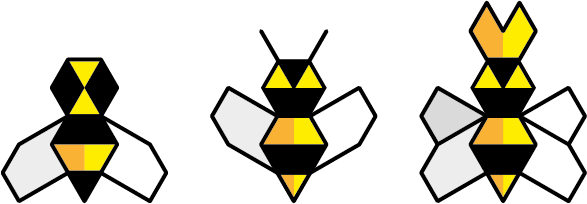

# Beesness

### **Beesness** is a game for 3-5 players that simulates a *capitalist market economy*. 

A *beesness* is a business for bees. 

Not your usual bees. In this game, bees have learned how to do business from us humans: they can *trade* flowers for honey and honey for more bees, they can *extort* honey from other beesnesses and even employ *cheap labour*. 

**You** play the director of one beesness. You **compete** against other players over flowers (resources) and honey (money). 

**To win**, your beesness must end the game with **more honey** than any other beesness. 

Your beesness operates in the **garden of Commons**. If all flowers are taken from the garden, at any point during the game, **everybody loses** immediately! To avoid this tragedy, you can **cooperate** with the other players to replant flowers.

Will you manage to maximise your honey profits while avoiding *drone strikes* and a collective *beesaster*?

## Versions!

This is a **work-in-progress** game. Below are different versions of the game we're prototyping and playtesting:

* [**v1**](versions/v1) was more of a playable theory than a game, back in 2015
* **v2** doesn't actually exist, we skipped straight to v3
* [**v3**](versions/v3) was v1 turned into something more playable
* [**v4**](versions/v4) is what we presented at [NowPlayThis 2017](http://nowplaythis.net/2017-events), where we had loads of fun with friends and friendly strangers. At the end of a 5-hours playtesting marathon that day v4.1 was born :hatching_chick:
* [**v4.1**](versions/v4.1) features a *beesaster* referendum :thumbsup: :thumbsdown:
* [**v4.2**](versions/v4.2) sports free-lance & full-time bees + gambling! :game_die:
* [**v5**](versions/v5) is still a cloudy idea :thought_balloon:
* **v6** is like v4.x with colours :rainbow:
* [**v7**](versions/v7) will feature a workers-owned cooperative :fist:

## License

This work is licensed under a [Creative Commons Attribution-NonCommercial-ShareAlike 4.0 International License](http://creativecommons.org/licenses/by-nc-sa/4.0)

