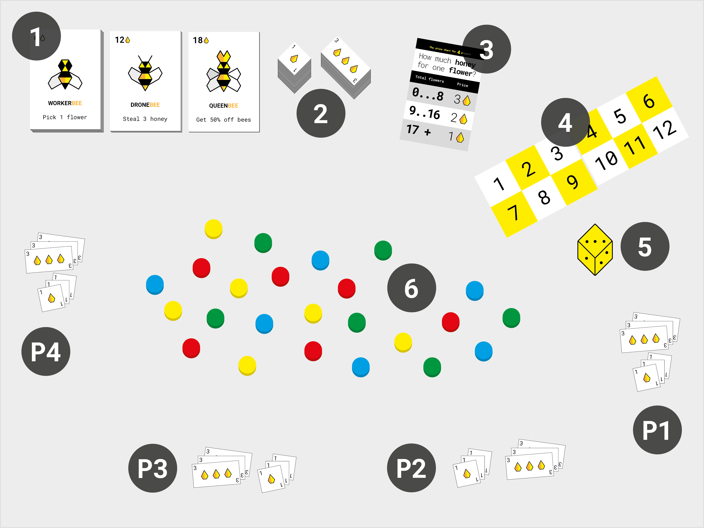
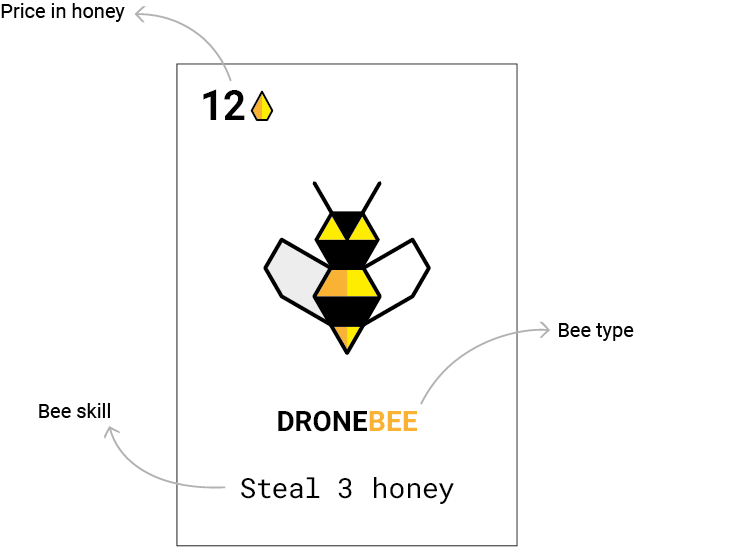

# Beesness

**Beesness** is a competitive / cooperative game for 2+ players that simulates a *capitalist market economy*. 

As a player you control a *beesness*. These peculiar bees have learned how to do business from us humans: they can *trade* flowers for honey and honey for other bees, they can *extort* honey from other beesnesses and even employ *cheap labour*. 

<!-- I think although cool, calling it beesness vs player throughout the manual can be confusing-->

# Goal of the game

**To win** you must end the year with **more honey** than any other beesness. This is the **competitive** part.

Every beesness operates in the **garden of Commons**. If all flowers are taken from the garden, at any point during the game, **everybody loses** immediately. To avoid this tragedy, you can **cooperate** with the other beesnesses to replant flowers.

Will you manage to maximise your honey profits while avoiding *drone strikes* and a collective *beesaster*?

# How to *beegin* setup

1. Place the **beesness cards** `1` face up, stacked by bee type.
2. Stack all the **honey** `2` in two piles. That will be the **bank**. 

	Each player starts with **12 honey** plus a **roll of the die** `5`. This could bring your starting capital to 18 honey! :game_die:
3. How many of you are playing? Take the **price chart** `3` for the current number of players and put it next to the bank. 
4. The **calendar** cards `4` track the rounds. Place them next to the price chart and put the die over the first month (1).
5. The *garden of Commons* `6` grows at the centre of the table. *Plant* **6 flower tokens** for each player. It doesn't matter which colour flowers are.

	> For example: if there are 4 players, *plant* 24 flowers. 

# How to *beehave* gameplay 

### Players take turns, going *clockwise* :alarm_clock: around the table.

**Rotate the starting player**. If you started this round, the player to your left will start the next.

<!-- Any 1st player token/meeple? -->

<!--
## Who starts the round?

There are two ways to decide this:

1. By **bidding honey**, a.k.a. *beedding*. The highest *beedder* pays the bank and gets the right to execute their *beesness plan* before all other players.
	
	If you wish, you can *beed* to start at the beginning of every round.
2. If nobody wants to *beed*, then you will **rotate the starting player**. If you started this round, the player to your left will start the next.
-->

## Phase 1. Your turn

### At the beginning of your turn you can **buy beesness cards** to grow your beesness. Then you can use your cards to **execute your beesness plan**.

(a) **Buy beesness cards**!

If you have enough honey and want to expand your beesness, you *can* buy one or more beesness cards. 
	
Pay the bank the price for each card in honey and add the card(s) to your beesness. If you have a queen you pay half the bank price for each card. 
	
You keep the cards throughout the game and can re-use them all at every round.

(b) **Execute your beesness plan**!  

Every beesness card has a skill. Use as many of your cards as you like. 

You can use new bees immediately, there's no need to wait for the next round.
	
	> For example: you have 2 workers, 1 drone and 1 queen. In Phase 1 a) You could use your queen to buy an extra drone at half price. b) Then use your 2 workers to pick 2 flowers (1 flower each) and use your drones to steal up to 6 honey from other beesnesses.
	
<!-- This makes the queen's function clearer that it's implemented in the buying phase only-->

## Phase 2. End of a round

### When all players have executed their *beesness plans*, the bank opens the **stalk exchange** and you have 1 minute to trade your flowers (as many as you want) for honey. Then you **replant the garden** and move to the next round.

(a) **Trade flowers on the stalk exchange**!

You have 1 minute to decide how many of your flowers to put on the stalk exchange. Everybody does this at the same time.
	
You could get between 1 and 3 honey for each flower you trade. Their price will depend on how many flowers are traded on the stalk exchange by all players. The more flowers, the less they are worth (a.k.a. [*supply&demand*](https://en.wikipedia.org/wiki/Supply_and_demand)).
	
Put the flowers you want to trade (from none to all) in your hand. Without revealing them, place your closed fist at the centre of the table. When everyone is ready, open your hands to show how many flowers you are trading.

Check the **price chart** to determine the **price of one flower**.
 
You get paid in honey, from the bank, for the flowers you are trading. 
	
	> For example: if you are trading 2 flowers and their individual price is 3 honey, you get 6 honey from the bank.

Your flowers are now sold. Discard them and take care not to place them in the common garden.

(b) **Replant the garden!**

   Replant **one flower per player**. Then **roll the die** and replant as many flowers as the die says. :game_die:

	> For example: if there are 4 players, add 4 flowers to the *garden*. Then roll the die: it's a 2, so you add another 2 flowers.

(c) Move the die to the next space on the **calendar** to keep track of the rounds.

# Meet the bees

Type | Price | Skills
---- | ----- | ------
**Worker**    | **6** honey | **Pick 1 flower per month** from the garden. 
**Drone**    | **12** honey | **Steal up to 3 honey per month** from other beesnesses in any combination, eg: 3 honey from 1 beesness, 1 honey from 3 different beesnesses, 2 from 1 beesness and 1 from another, etc.
**Queen**    | **18** honey | Buy other beesness cards at **half their normal price**. 

## Anatomy of a beesness card

# How to win

### At the end of the last month (12), **the player with the most honey wins!**

# How not to lose

### If the garden runs out of flowers, at any point during the game, everybody loses *immediately*.

To avoid this *beesaster*, you can decide all together to **donate** one or more of your beesness cards in order to replenish the garden. 

Each beesness card can get you 1 flower. 

You don't all have to give back the same number of cards. For example, one player may decide to give back 1 bee, and another player 3 bees. Discuss and try to reach a consensus. 

Put the cards you are donating onto their stack next to the bank and replant the garden with the corresponding number of flowers.

<!-- It's not clear to me when this should happen, I think maybe you need to add a checkpoint during the phases. For example if in the phase 2 (b) replanting there are no flowers in the garden then a consensus has to be made before replanting. More interestingly it could be made into a similar mechanic as the market.

Everyone grabs one flower token and decides to either secretly put in their hand (I agree to donate a bee) or not (I don't agree). So the incentive is to not donate your bee but if everyone is selfish GAME OVER-->

# Sticky situations FAQs   

1. **Can I sell bees?**

	**No**. You are not allowed to sell your bees back to the bank. You can however **trade bees with other players**: see if anyone is interested in your bees and negotiate a price.
	
	<!-- You cannot dismiss bees. You can only make them redundant if you're being attacked by a drone and don't have enough honey -->
	
	<!-- I didn't know this rule? is it new? it changes the game somewhat -->
2. **Do my bees count at the end of the game?**

	**No**. It's just the honey you have (that is, your *profits*) and not the overall *valuation* of your beesness. 
3. **Can I make alliances with other players?**

	Sure, why not? The terms of your trade agreements are up to you. 
4. **What if I use my drone(s) against a beesness that has not enough honey?**

	You can force them to use one or more of their beesnesses cards as *payment* (eg: put a *worker bee* back to the stack, get 6 honey from the bank and pay you).
5. **Can I use a drone and buy more beesness cards with the loot?**

	Not during the same turn. You'll have to wait your next turn to invest your loot into new beesness cards.

## License

This work is licensed under a [Creative Commons Attribution-NonCommercial-ShareAlike 4.0 International License](http://creativecommons.org/licenses/by-nc-sa/4.0)

