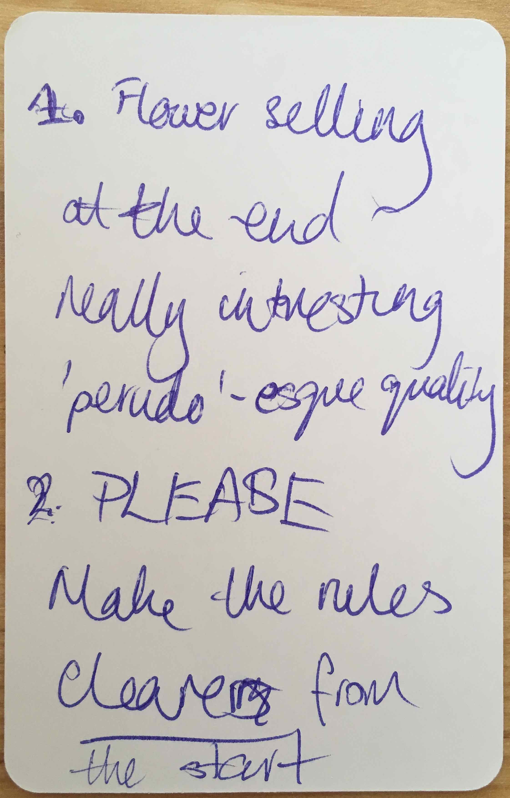
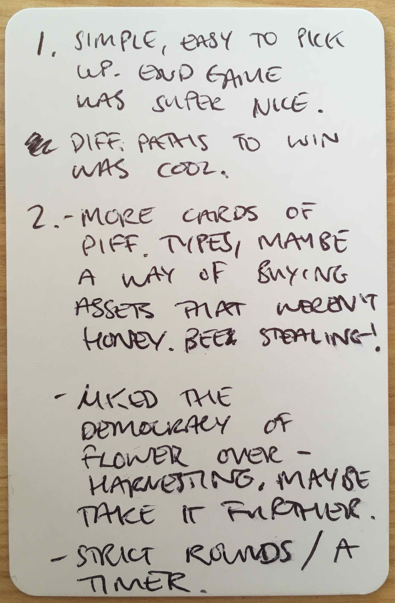
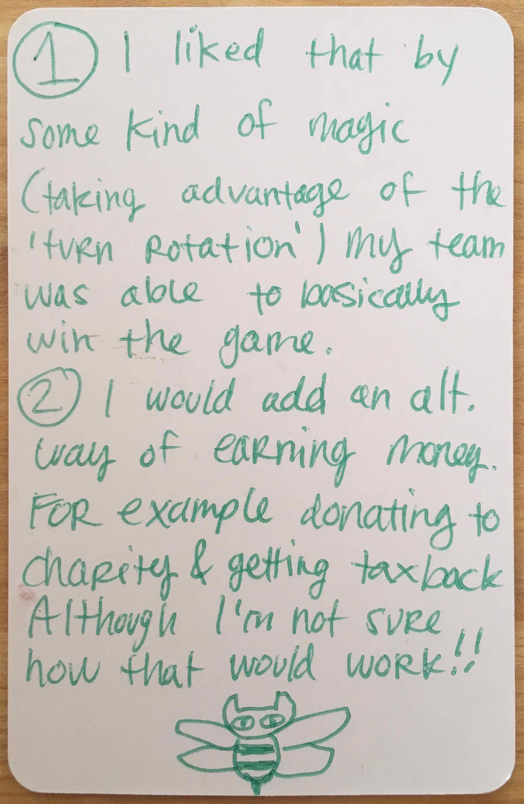
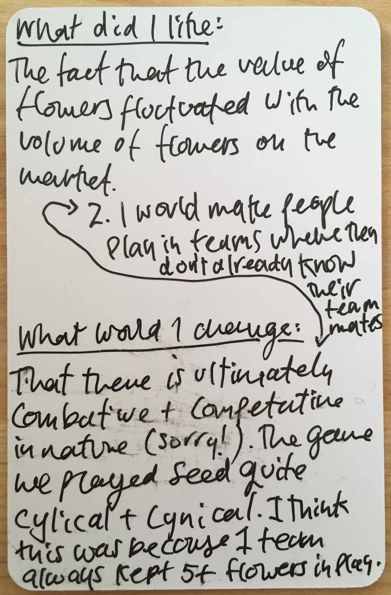
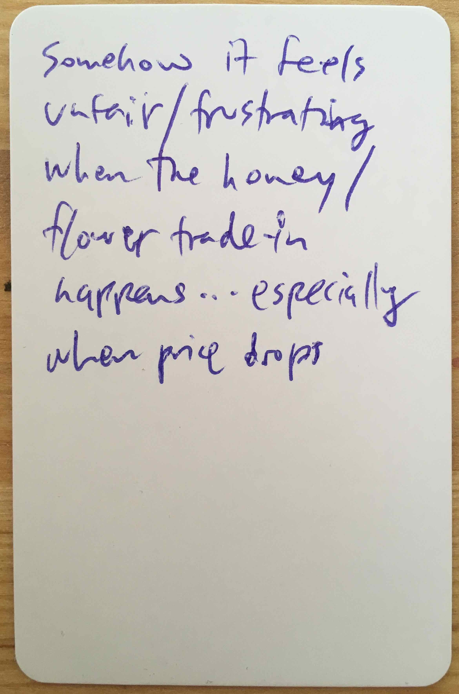
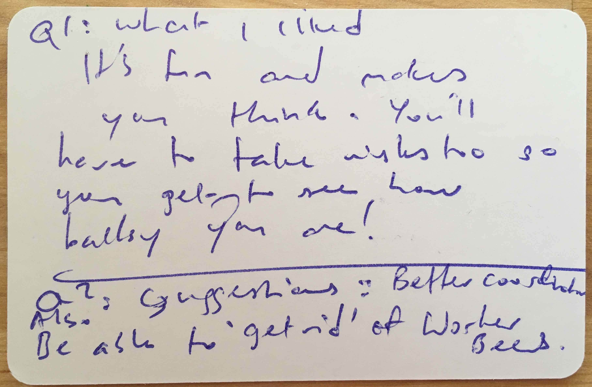

# William IV v4.2 - 4p

Tested [v4.2](../versions/v4.2) with Amy, Brandy, John, Sam, Taba, Evan, Neha and Melvin at the William IV.

[Listen to them playing and their feedback after](https://soundcloud.com/bpt20170519/evan-taba-john-sam-brandy-amy-melvin-and-neha-william-iv?in=beesness/sets/playtesting).

Main differences from v4 and v4.1:

* **8 rounds** instead of 12.
* Replanting **one flower per player**.
* **Ref**: instead of 1 vote per player, you get one vote per bee (hard to solo-test but sounds like a good idea).
* Each player can only pick flowers of their chosen colour (to limit 1st-player advantage). This also means that *Beesaster* happens **if flowers go below the number of players** (eg: with 4 players, the game is over if there are 3 or less flowers left).
* **Bees market**. Instead of buying bees during their turn, players buy their bees all together, right after they sold flowers (to limit 1st-player advantage).
* Bees: **freelance and full-time**.

Type | Price | Action | Discard or keep?
---- | ----- | ------ | ----------------
**Drone** | **3** honey | Roll the die and then **steal as much honey as the die says** from another beesness. | Discard
**Worker** | **6** honey | **Pick 1 flower** from the garden. | Keep
**Queen** | **12** honey | Roll the die and then **save as much honey as the die says**. This means that drones won't be able to steal that honey, but also that you won't be able to use that honey to buy new bees (think of it as a *pension pot*). Place the saved honey on top of your Queen card. | Keep	

Final scores:

|  | Evan&Taba | John&Sam | Brandy&Amy | Neha&Melvin | 
|--|--|--|--|--|
| Drone | ? | ? | ? | ? |
| Worker | 1 | 3 | 4 | 3 |
| Queen | 1 | 1 | 0 | 1 |
| Honey | 18 | 17 | 18 | 13 |

In this game there were no referendums, as Taba&Evan kept 5 of their flowers in the garden at all time (picking 1 per turn with 1 worker)

## What went well

* Being able to **only pick flowers of your chosen colour** significantly limits the 1st player advantage, and it also simplifies the part when you pay off people after the flowers market (players give you the flowers they're selling and you can immediately work out who gets what).
* The **bees market** also limits the first player advantage and speeds up the game.
* The **final scores** was very close, which meant everyone seemed invested in the game till the end.
* People liked the **flower market** (see feedback cards below).

## Even better if

People suggested a few things:

* **Reference cards**: quick overview of rounds and player actions on their turns (I scribbled a couple for Taba). She also mentioned the flower market reminds her of [Perudo](http://www.perudo.com/perudo-rules.html).
	

* Sam suggested to have a **timer** to limit people's turns and the market phase. Also he'd like more cards of different types, maybe a way of buying assets that weren't honey (bee stealing?)
	

* Brandy would also like different ways of *making honey*, such as charity / taxback.
	

* Both Amy and Brandy felt uneasy with the combative / competitive nature of the game, being constantly pitted against each other and ending up *robbing or being robbed*.

	Amy also suggested that when playing in teams, it would be more fun to pair up people who don't know each other.
	

* Evan felt the flower market was *unfair*.
	

* Neha would like to be able to take flowers of all colours?
	

* Melvin would like to be able to make bees redundant
	
	

## Actions

- [ ] Keep experimenting with 9 rounds for 3 players, 8 rounds for 4 (and 10 for 5?).
- [x] **Start with a worker, a drone and 6 honey** (no die roll).
- [x] Keep experimenting with the **drone as an expendable card**.
- [x] Keep experimenting with the queen as *savings account*, but with a **cap** (12, or whatever the price of that card is). 
- [x] **Bees market** right after the flower market and before the start of a new round. Including the first round.
- [x] Keep experimenting with the *privatised garden*, a partition of the Garden of Commons where only you can pick flowers. You **replant 1 flower per colour**.
* [x] **Ref**: instead of 1 vote per player, you get one vote per bee.
- [ ] Drone as a defence card (Risk-style).
- [x] Design **reference cards**.
- [ ] **Flower market charts**: `-` or `→` instead of `...`. Also make it clear that it's the total number of flowers players are selling this round (maybe have a reference card for this too).
- [x] **Calendar** / round tracker should be a single line, and have indications for when the game ends (depending on the number of players).
- [ ] Solo-playtest the **drone power allowing you to take other people's flowers** (instead of honey), and if you manage to sell the *stolen* flowers you double your profit on it. What's the risk?
- [ ] Solo-playtest the **drone as a tax-dodging** bee.