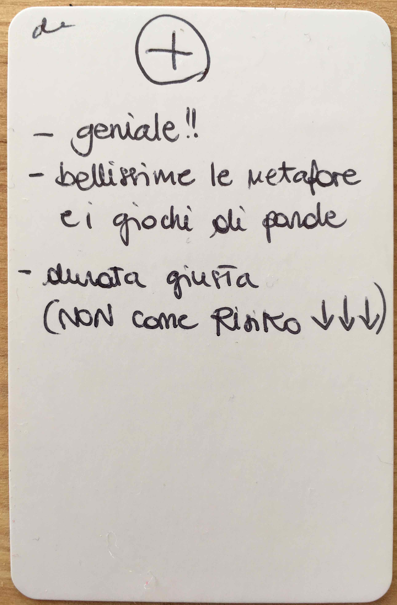
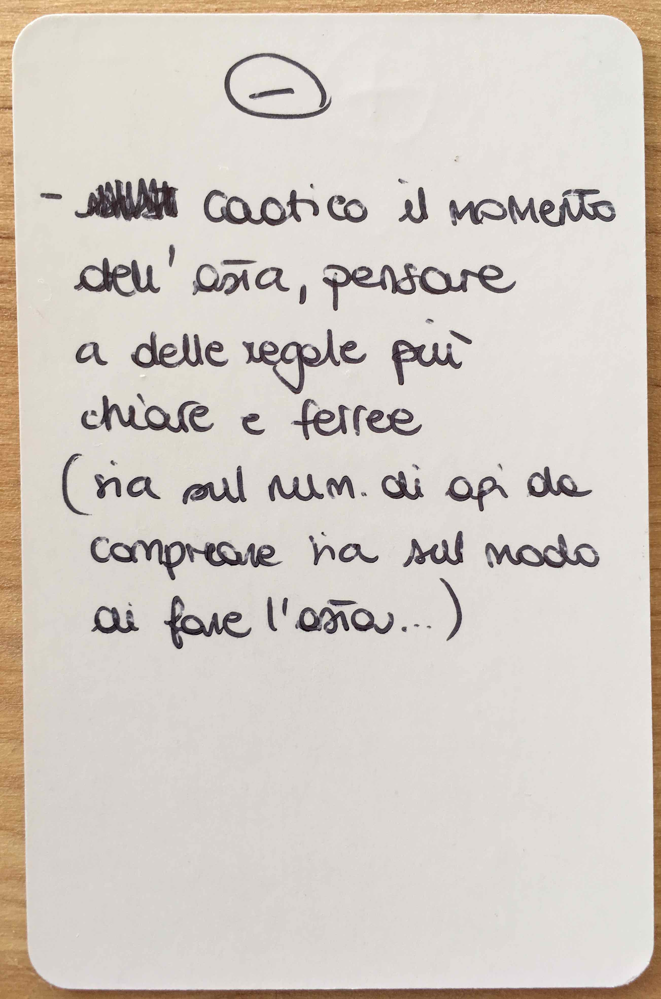
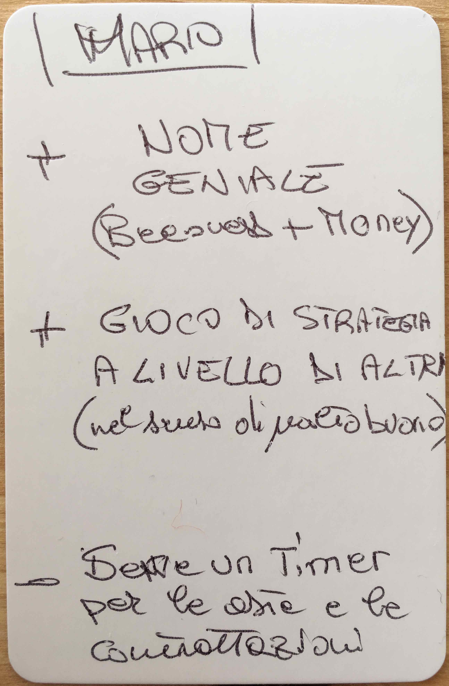
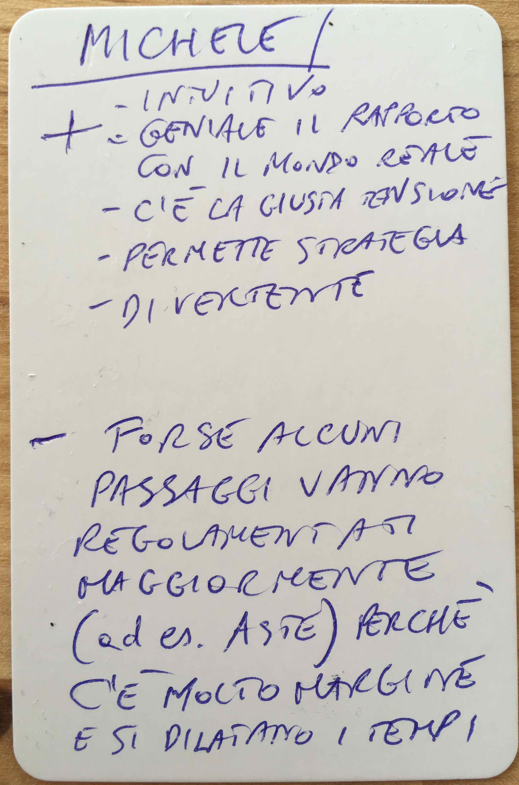
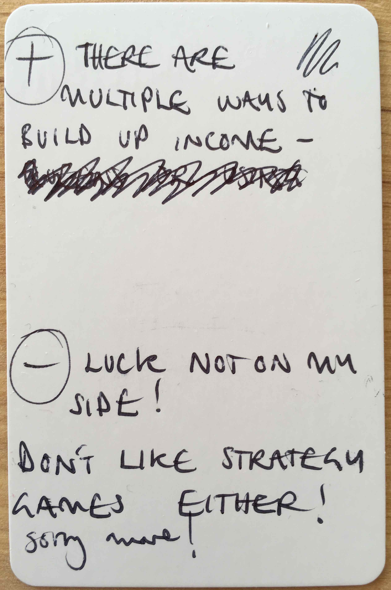

# MuccaPez v4.2 - 4p

Tested [v4.2](../versions/v4.2) with Aimee, Mario, Michele and Sara in Cles (TN, Italy).

[Listen to them playing](https://soundcloud.com/bpt20170627/aimee-mario-michele-and-sara-v42-muccapez?in=beesness/sets/playtesting).

Tweaks / experiments:

* [NEW] **No replanting** flowers at the end of each round.
* [NEW] **Flower market's capacity is 36 H**, prices go as follows 

	| Flowers | Price | 
	|--|--|
	| 1 | 36H |
	| 2 | 18H |
	| 3 | 12H |
	| 4 | 9H |
	| 5 | 7H |
	| 6 | 6H |
	| 7-8 | 5H |
	| 9-10 | 4H |
	| 11-14 | 3H |
	| 15-23 | 2H |
	| 24+ | 1H |
	
* Players can *trade* two or more bees for another bee with the bank, eg trade a worker (6H) for 2 drones (3H + 3H), 2 workers (6H + 6H) for a queen (12H).
* Bees are limited: 6D, **6W** and 6Q.
* Players start with 1W + 6H.
* Queen's cap is 12 honey.
* Referendum: each player gets a vote. If it's a tie, you count the number of bees (larger beesnesses win).

## What happened

Michele and Aimee stocked up on drones and kept attacking each other (`con questo rubo da Aimee...`) whilst Sara and Mario took a more low-profile approach. Michele was luckier than Aimee with the die, which is reflected in the final scores:

| | Aimee | Sara | Michele | Mario | 
|--|--|--|--|--|
| Honey | 30 | 33 | 36 | 24 |

A referendum was called on round 4 (half game). 

## What went well

**Bees scarcity** leads to auctions when two or more players want to buy the same bee. In other words, *scarcity makes for a more interesting market*. As Peter Frase put it in [Four Futures](http://www.goodreads.com/book/show/22551901-four-futures) (p.82) 

> Economists like to say that capitalist market economies work optimally when they are used to allocate scarce goods.

People liked the *metaphors* and the bee-puns.

 

Sara also commented that the duration of a game feels `right` (but also stated that the market+auction phase could be streamlined, see below)

## Even better if

* It wasn't clear that the **queen capacity is 12 H**.

* It wasn't clear that you can carry out your **actions during your turn in any order**.

* It wasn't clear that if a referendum goes ahead, **you sacrifice any one of your bees** (not a specific one). 

* The usual question about the bees' valuation counting at the end of the game towards victory. I should state in the initial explanation: **it's just your honey that counts, not your bees**.

* The bees market was slow and chaotic, especially when there were **auctions**. Several players asked for clear protocols to speed it up and make it *fairer*.  

	

	

	

* In the last round it was clear that Michele would have won anyway, as he would have more honey than anyone could make. There could be a special, **two-step last market**, aka the *2 instalments* idea from the previous playtest. This could make it less predictable (if one step, all flowers would go in) and create the opportunity for a last-minute turn of fortunes.

* Michele suggested that the **honey you save on the Queen shouldn't be touched** but could be earning interest once it's topped up or so (`it's a cultural thing, people from Val di Non wouldn't use them anyway`).
	
* There should be some sort of **penalty** for a player taking damaging actions like taking your last flower.

* Aimee pointed out something I've been brewing for a while. Despite my efforts to limit the power of drones and their chance-based mechanics, she still felt that **one wins more by luck than by strategy**.

	

## Actions

- [ ] Keep testing the **honey pot** for flower market (36H).
- [ ] **Last market** in 2 or 3 *instalments*.
- [ ] Solo-playtest: freelance workers.
- [ ] Keep experimenting with **trading** bees, eg trade a worker for 2 drones, 2 workers for a queen etc.
- [ ] Reference cards: players can play their turn **actions in any order**.
- [ ] Reference cards: make it clear that players can **use all their cards** they have during their turn.
- [ ] Reference cards: remove reference to `selling` bees (it's trading). 
- [ ] Honey limit (12) should be on the Queen card.