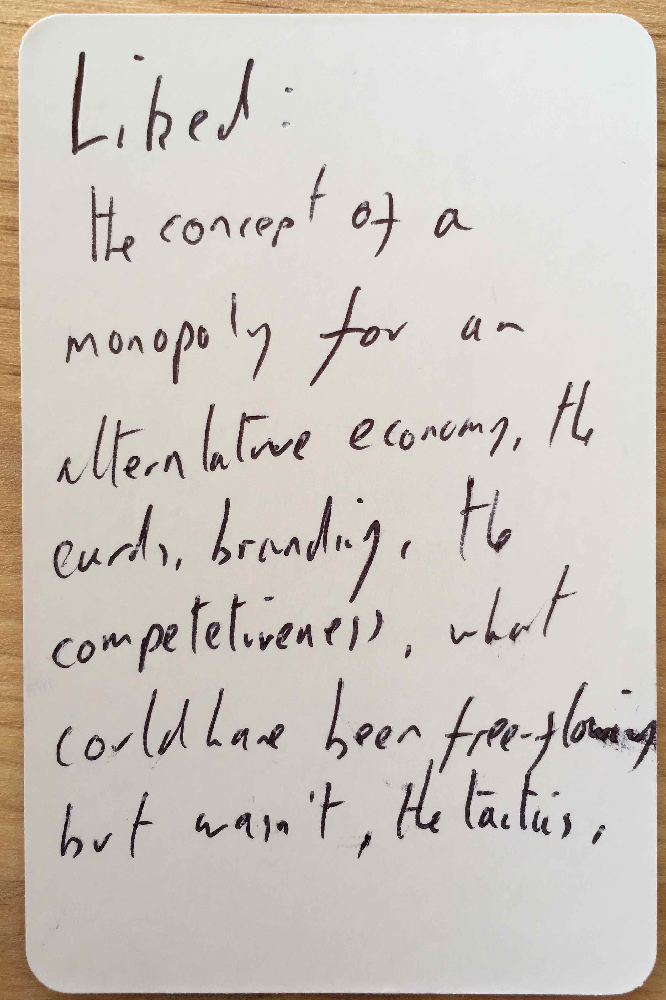
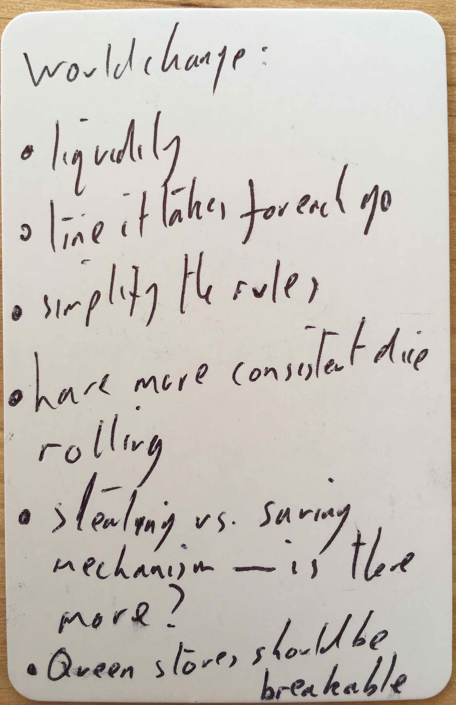
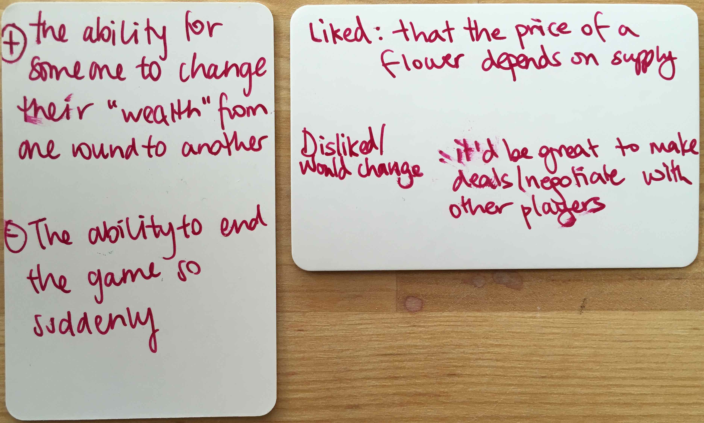
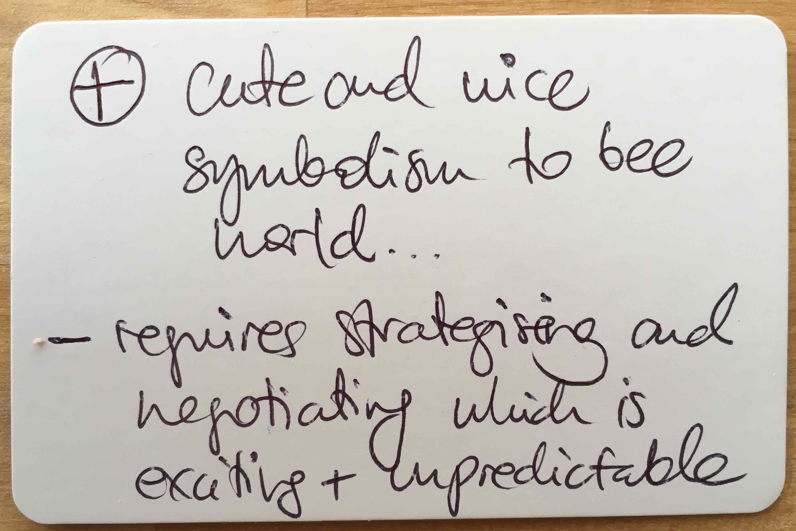
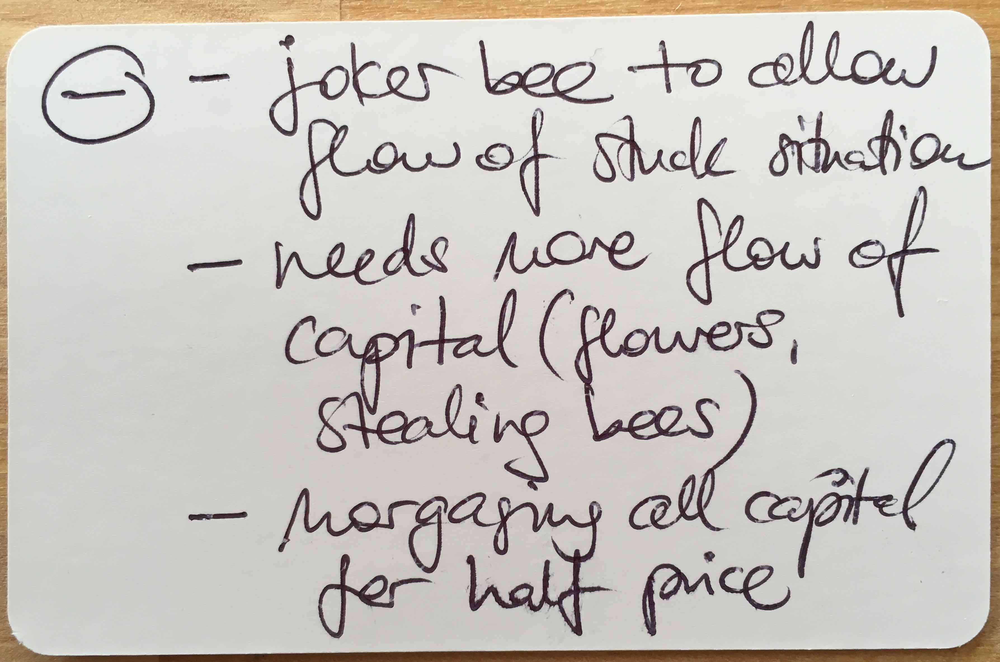

# The Hive v4.2 - 4p

Tested [v4.2](../versions/v4.2) with Ali, Dom, Michael, Ida, Grit, Denise and Danae at The Hive.

[Listen to them playing](https://soundcloud.com/bpt20170629/ali-dom-michael-ida-grit-denise-and-danae-v43-the-hive?in=beesness/sets/playtesting).

Tweaks / experiments:

* [NEW] **No replanting** flowers at the end of each round.
* [NEW] **Flower market's capacity is 36 H**, prices go as follows 

	| Flowers | Price | 
	|--|--|
	| 1 | 36H |
	| 2 | 18H |
	| 3 | 12H |
	| 4 | 9H |
	| 5 | 7H |
	| 6 | 6H |
	| 7-8 | 5H |
	| 9-10 | 4H |
	| 11-14 | 3H |
	| 15-23 | 2H |
	| 24+ | 1H |
	
* Players can *trade* two or more bees for another bee with the bank, eg trade a worker (6H) for 2 drones (3H + 3H), 2 workers (6H + 6H) for a queen (12H).
* Bees are limited: 6D, **6W** and 6Q.
* Players start with 1W + 6H.
* Queen's cap is 12 honey.
* Referendum: each player gets a vote. If it's a tie, you count the number of bees (larger beesnesses win).

## What happened

Played with teams. A couple of referendums were called and went through. On round 7, Michael decided to pull the plug as he realised he couldn't win and wanted to see what would have happened. Contrary to the [previous similar situation](https://github.com/beesness/game/blob/master/playtesting/2017-05-15.md) there were no heated discussions when that happened. Players seem to accept it as an unfortunate end to the game, and Ali congratulated Michael for his *boldness*. Denise and Danae still felt like they won as they had more honey than anyone else when *beesaster* was triggered.

## What went well

This game exposed the sharp edge of the game, the **beesaster**. Players didn't try to avoid it, but interesting suggestions came out of it. 

## Even better if

* It wasn't clear that if a referendum goes ahead, **you sacrifice any one of your bees** (not a specific one). 

* This game confirmed that the **auction phase** is chaotic and unruly.

* Playing with **8 people** (4 teams) and collecting meaningful feedback from all is tricky :) 

* The game was a bit too long. Let's experiment with shorter games in the next playtests: **4 rounds instead of 8**. This way, players should still get a taste of the game, enough to give valuable feedback without taking the whole evening!

* Grit thought there were many situations where you **feel stuck**. Dom liked the game being fast.

* Grit and Ida would like a **joker bee** that allows you to inject flowers, or some other actions that get you `unstuck` (vetoing the referendum, steal flowers). 

* Ida would **turn everything into capital**, eg you can trade the bees back for honey, for a lesser price than their initial cost.

* Ida and Grit kept wanting to buy drones during their turn, instead of during the market. 

* Denise felt that it's hard to **turn the game around** if you don't play well early in the game.

* She also thought there is **no incentive to hold on to cash** (even though it's the goal of the game).

* Dom would like to have a **board** with nice instructions.

* Roll the die to determine the **first player**.

* Bring **pens** for everyone to write down their feedback.

* Grit thinks there should be some **consequence** for taking the last flower and triggering *beesaster*. Dom said otherwise the incentive to end the game is too strong. Maybe the game carries on but you're barred from the market for one or two rounds.

* Denise suggests to try and **play on after a beesaster** with negotiations and trade (there would be still flowers of other colours).

* Michael brought up an idea I had before: turn **worker bees into freelancers**.

## Actions

- [ ] **Freelance workers**.
- [ ] Roll the die to determine the **first player**.
- [ ] **4 rounds instead of 8**.
- [ ] Explain clearly that if a referendum goes ahead, **you sacrifice any one of your bees** (not a specific one).
- [ ] You can **trade the bees back for honey**, for a lesser price than their initial cost (1/2 or 1/3 of initial cost)?
- [ ] Keep experimenting with **trading** bees, eg trade a worker for 2 drones, 2 workers for a queen etc.
- [ ] Solo-playtest: some **consequence** for taking the last flower and triggering *beesaster*. Maybe the game carries on but you're barred from the market for one or two rounds.
- [ ] **Last market** in 2 or 3 *instalments*.
- [ ] Solo-playtest: **joker bee**?
- [ ] Solo-playtest: unilaterally decide to give back one bee for 2 flowers?
- [ ] Reference cards: players can play their turn **actions in any order**.
- [ ] Reference cards: make it clear that players can **use all their cards** they have during their turn.
- [ ] Reference cards: remove reference to `selling` bees (it's trading). 
- [ ] **Timer**: 1 minute.
- [ ] Honey limit (12) should be on the Queen card.
- [ ] **Calendar** with turn & market phases.
- [ ] Solo-playtest: *Hive* card for savings. What about the Queen then?
- [ ] Solo-playtest: special bees (lazy, burn-out, defender, recruiter etc.)
- [ ] Solo-playtest: **round-based events**, eg *this round everyone loses a worker*, or *this round the queen is striking*