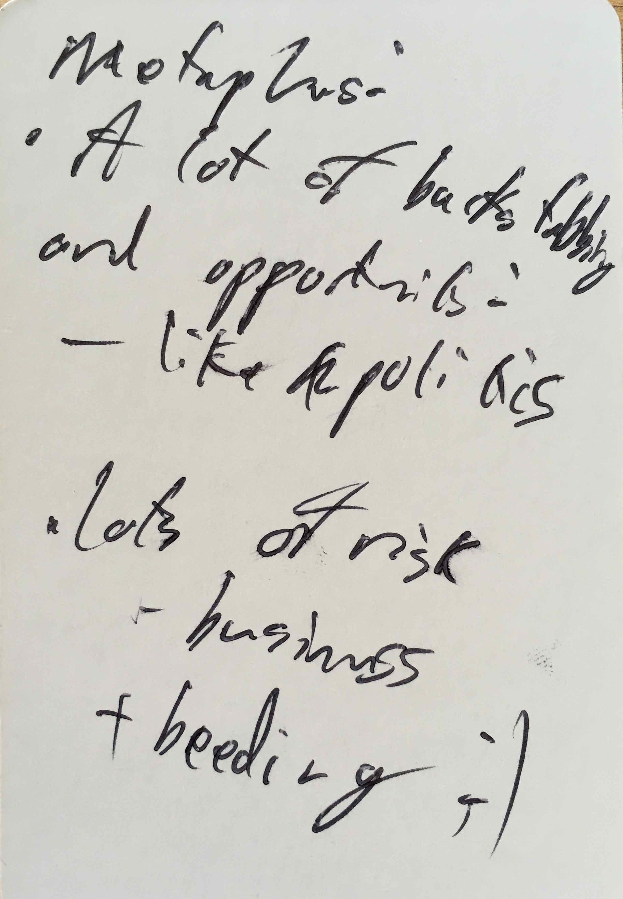
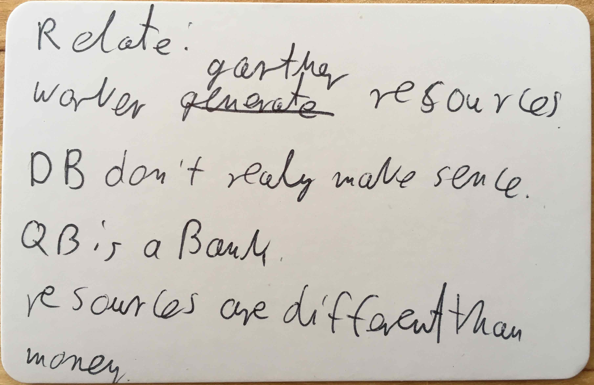
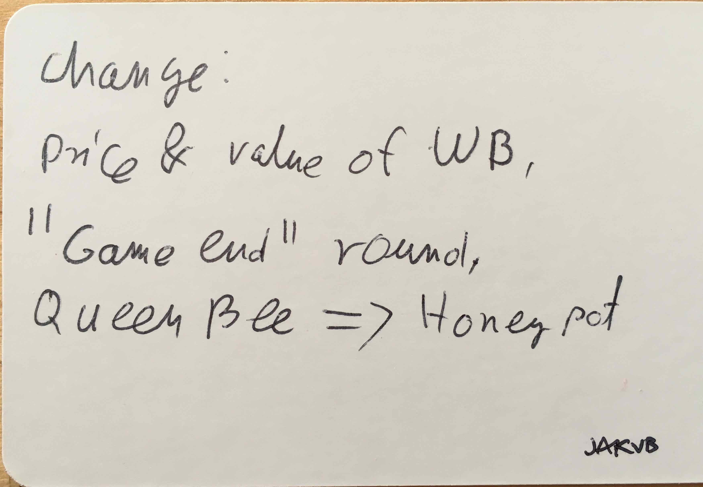
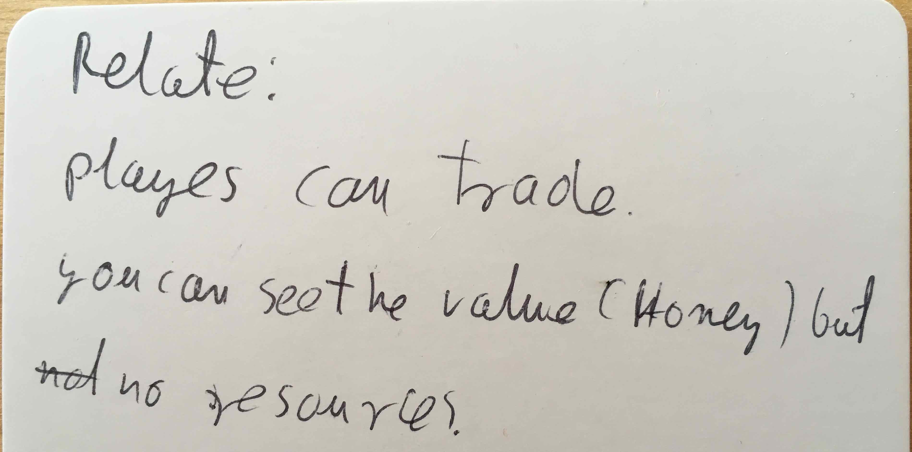
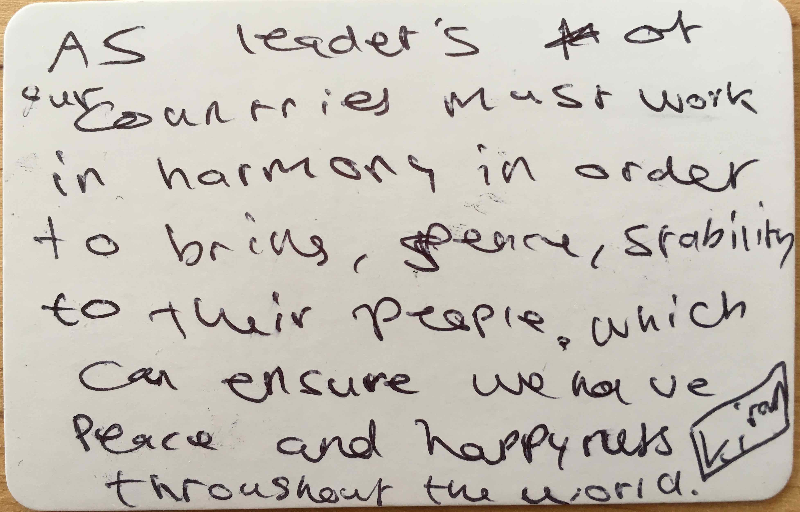
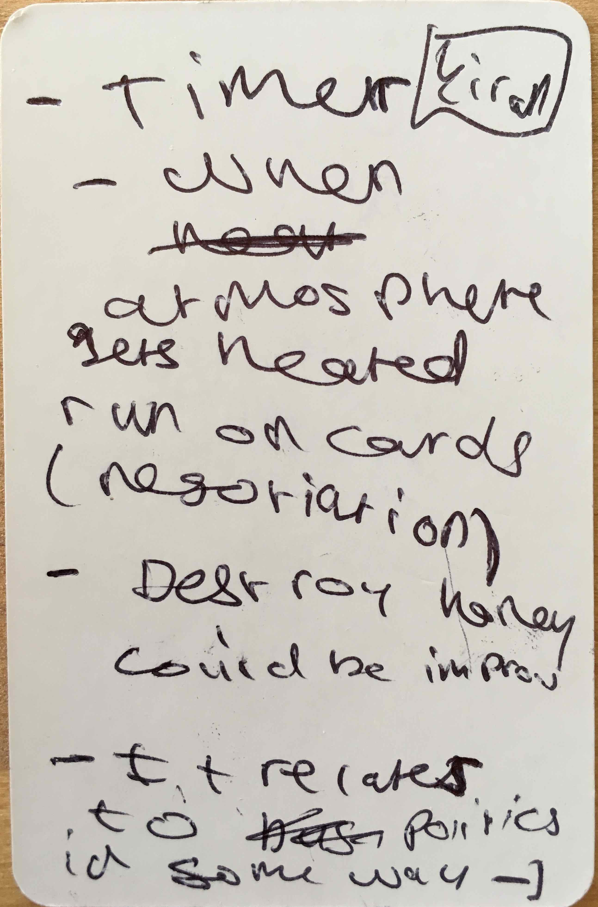
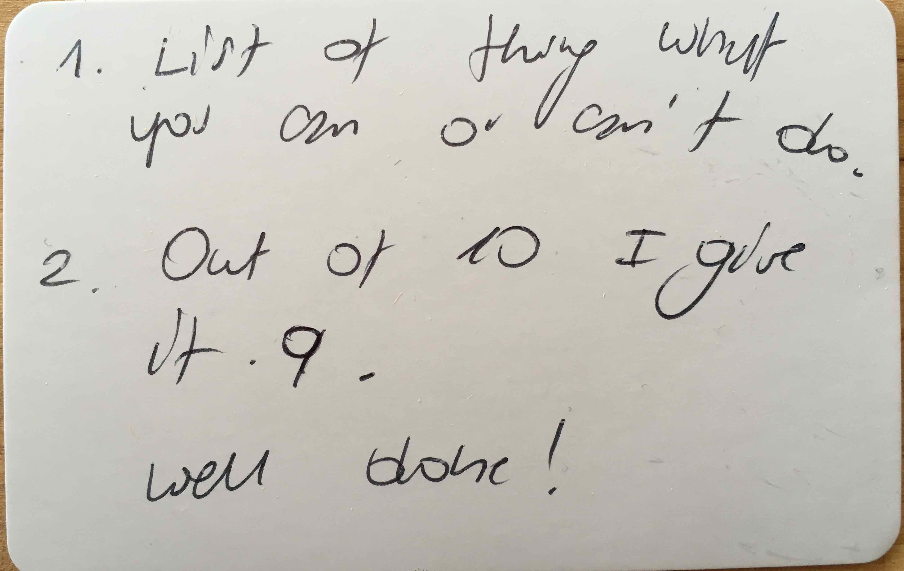
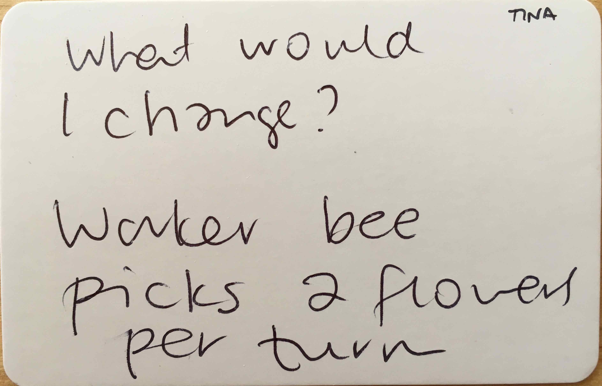
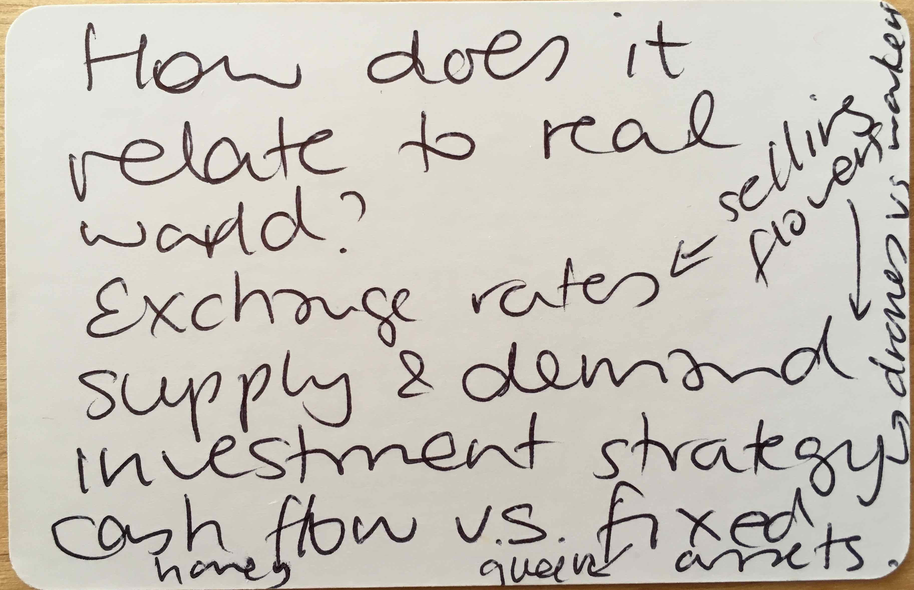

# Ada College v4.3 - 4p

Tested [v4.3](../versions/v4.3) with Tina, Olga and several students at Ada College.

[Listen to them playing the first game](https://soundcloud.com/bpt20170630/tina-olga-kiran-ayo-ramil-jakub-and-ignas-v43-ada?in=beesness/sets/playtesting) and the [second game](https://soundcloud.com/bpt20170630/kiran-ayo-dee-jakub-and-ignas-v43-ada?in=beesness/sets/playtesting).

New version! **4.3** includes:

* [NEW] **Freelance workers**, price 1H.
* [NEW] **2-step** market after the last round.
* [NEW] Only **1 colour** flowers.
* **No replanting** flowers at the end of each round.
* **Flower market's capacity is 36 H**, prices go as follows 
* Players can *trade* two or more bees for another bee with the bank, eg trade a worker (6H) for 2 drones (3H + 3H), 2 workers (6H + 6H) for a queen (12H).
* Bees are limited: 6D, 6W and 6Q.
* Players start with 1W + 6H.
* Queen's cap is 12 honey.
* Referendum: each player gets a vote. If it's a tie, you count the number of bees (larger beesnesses win).

	| Flowers | Price | 
	|--|--|
	| 1 | 36H |
	| 2 | 18H |
	| 3 | 12H |
	| 4 | 9H |
	| 5 | 7H |
	| 6 | 6H |
	| 7-8 | 5H |
	| 9-10 | 4H |
	| 11-14 | 3H |
	| 15-23 | 2H |
	| 24+ | 1H |

## What happened

We played 2 short games, just 4 rounds and 12 flowers (instead of 24) and made changes between the first and the second.

1. It felt that there wasn't enough cash lying around, because workers were too expensive (6H). 
2. We decided to drop the workers' price to 3H and increase its power to 2F. 

The first game was quite tight, the second very tense: Jakub and Kiran threatened to end the game by taking the last flower several times and asked for ransom (Jakub even put a timer to make it even more dramatic).

## What went well

* Lay out all the elements of the game so that we're ready to start, and then explain the game by showing each element and modelling its behaviour, eg. rolling the die when you explain the drones.

* Summary cards are useful. Inspires questions from players. 

* Questions before we start the game?

* People seem to like the limited bees.

* People like the chance element.

## Even better if

* It was clear by the last round who the winner was. We didn't try the 2-step market, Tina instead proposed a *mop-up* round to save&attack (finish up your drones).  

* Workers should be cheaper.

* Tina mentioned being *stuck* in certain rounds. Partly because the workers are expensive to afford, so everyone will try and sell all their flowers immediately.

* Tina proposed workers to have 2F potential.

* Jakub proposed that players be able to poach bees from other players by paying them more than their current cost. (How would you keep track of them though?)

After the second game, people suggested that we have **more bees** (or same bees with multiple skills) eg:

* Worker can pick a different number of flowers (1 or 2)
* Drones can also steal flowers
* Queen can poach bees
* Queen can hatch bees that randomly turn into a worker or a drone 

Another idea was to have a **secret mission** that people draw at the beginning of the game (which could also work as alternative ways to score *victory points*) eg: 

* short-term profit
* long-term profit
* most bees
* most flowers
* etc.

Overall, the second game with more flowers was more fun, but I still feel that this version relies on chance too much.

## Actions

- [ ] **More bee skills**.
- [ ] **Alternative ways to score points** (or secret mission).
- [x] **Freelance workers**.
- [x] Roll the die to determine the **first player**.
- [x] **4 rounds instead of 8**.
- [ ] Explain clearly that if a referendum goes ahead, **you sacrifice any one of your bees** (not a specific one).
- [ ] You can **trade the bees back for honey**, for a lesser price than their initial cost (1/2 or 1/3 of initial cost)?
- [ ] Keep experimenting with **trading** bees, eg trade a worker for 2 drones, 2 workers for a queen etc.
- [ ] Solo-playtest: some **consequence** for taking the last flower and triggering *beesaster*. Maybe the game carries on but you're barred from the market for one or two rounds.
- [ ] **Last market** in 2 or 3 *instalments*.
- [ ] Solo-playtest: **joker bee**?
- [ ] Solo-playtest: unilaterally decide to give back one bee for 2 flowers?
- [ ] **Timer**: 1 minute.
- [ ] Honey limit (12) should be on the Queen card.
- [ ] **Calendar** with turn & market phases.
- [ ] Solo-playtest: *Hive* card for savings. What about the Queen then?
- [ ] Solo-playtest: special bees (lazy, burn-out, defender, recruiter etc.)
- [ ] Solo-playtest: **round-based events**, eg *this round everyone loses a worker*, or *this round the queen is striking*