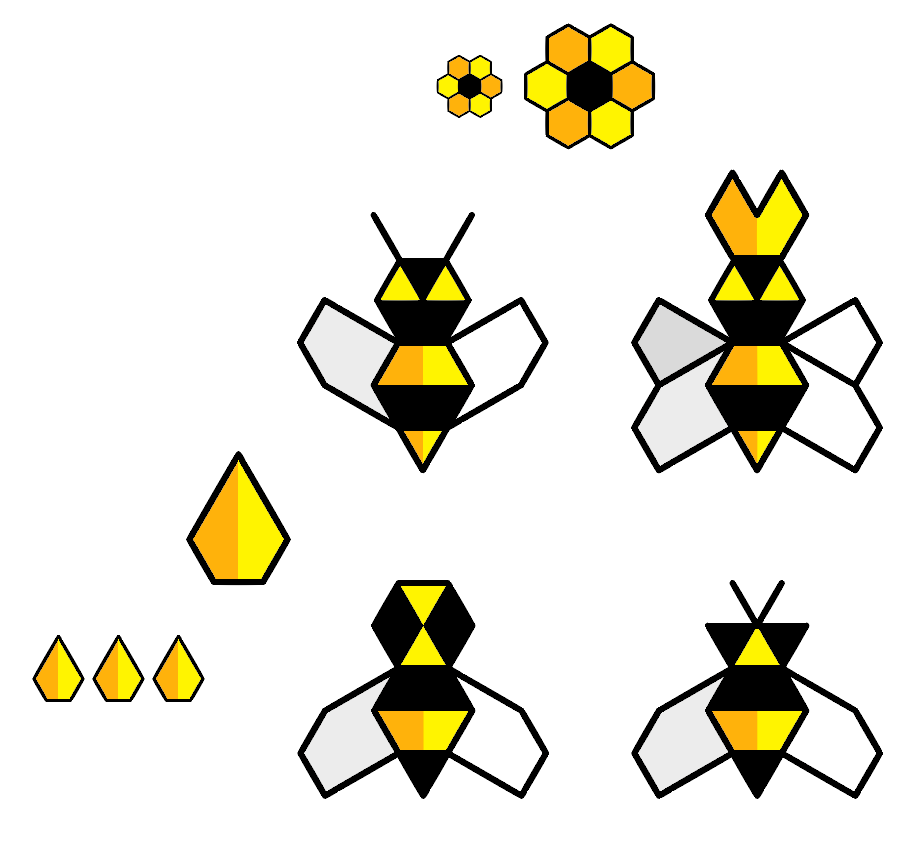

<!--### TODO

- [x] Tech? No tech
- [x] Can you trade tech for bees? Nope.
- [x] How many bees do you start with?
- [ ] We also have beeswax, pesticides, sting, pollen, nectar..
- [x] *Nectar cards*? Nectar and pollen are bees' food. In literal terms, these would be *extraction power* cards. We can have one nectar card which gives you *competitive advantage*: the right to start a turn first.
- [x] Queen - worker - drones
- [ ] scarce harvest?-->

# Open Beesness

### A *playable* simulation of a **capitalist economy** 

As a player, you control a *bee colony*. 

All colonies operate in the *garden of Commons*.

Throughout the game, you can deploy different *beesness models*: from converting flowers' nectar into honey, to stealing other colonies' honey, privatising flowers and other nasty moves..

### Your goal

To have the most **honey** at the end of the year!

#### End game scenarios

1. At the end of the year (12 turns), the colony with the **most honey wins**, provided there are still some flowers left in the *garden*.
* If all flowers are picked from the garden, at any point during the game, **everybody loses**.

<!--or after 3 consecutive turns with scarce extraction. -->

### Unpacking the metaphors

Just in case you still think this is about *bees*.

Symbol			| Meaning
------ 			| -------
Colony  		| Private company / corporation
Flowers			| The Commons ideas, raw materials etc.
Honey				| Money
Turns				| Time
Worker bees	| Self-explanatory
Drones			| Military?
Queens			| Growth?

<!--Nectar card	| Competitive advantage-->

#### What other metaphors can you think of?

Could you *re-skin* this game with a different set of symbols? 

How would that impact the meaning(s) produced during the gameplay?

### SETUP

#### How many players? 

From **2** to **infinity**. 

#### The garden of Commons

Plant **flowers** in the garden, according to the number of players.

Players			| Flowers
------ 			| -------
2  				| 10
3  				| 15
4  				| 20
5  				| 25
6  				| 30
etc.  			| The formula: 5 × players

#### The colony

Each player starts with **1 worker bee**.
 
#### The bank 
 
Place all the **honey** aside. That will be the **bank**. 

If necessary elect a player who will take care of the honey handling.

#### The calendar 

Put a **month marker** (any token) on the first month of the year.

<!--#### The nectar card

Determine a starting player and give her the **nectar card**.

This gives a player the right to start first in a turn.-->

#### The colonial cards

Place the **colonial cards** aside and face up, stacked by type (4 stacks).
<!--
NAME | PRICE honey	| RUNNING COST honey | SKILLS
---- | ----------------	| ---------------------- | ------
**Worker** bee		| 2    	| 1   | Take **2 flowers / month**  **IF** the garden has more than half of the starting flowers   (eg: `if flowers > 10` when there are 4 players) 
**Austerity** bee	| 4    	| 2   | Take **2 flowers / month**
**Drone** bee 		| 8    	| 3   | Take **3 honey / month**
**Queen** 				| 16   	| 4   | Generate **1 bee / month**  OR  Privatise **1 flower / month**
-->
NAME | PRICE honey	| SKILLS
---- | ----------------	| ------
**Worker** bee		| 2    	| Take **1 flower / month**  **IF** the garden has more than half of the starting flowers   (eg: `if flowers > 10` when there are 4 players) 
**Austerity** bee	| 4    	| Take **1 flower / month**
**Drone** bee 		| 8    	| Take **3 honey / month**
**Queen** 				| 16   	| Generate **1 bee / month**  OR  Privatise **1 flower / month**

### GAMEPLAY

Every turn (month):

1. **Who starts?**
	
	You can invest extra honey to execute your *beesness strategy* before all other players. 
	
	You do so by **bidding honey**. The highest bidder gets the *nectar card* (that is, the right to start first) and gives the honey to the bank.
	
	This is optional, but starting first in a turn may be useful in times of *austerity*.
2. **Execute your beesness strategy!**

	Starting from the player with the *nectar card* and proceeding clockwise, everyone plays their colonial cards.
	
	You can play from zero cards (but why would you?) to all of them.  
	
	**Sticky situations**
	
	IF	| BUT | THEN
	-------	| --- | ----
	you want to use a **worker bee** to pick flowers | there are not enough flowers at the beginning of your turn to meet the condition `if flowers > X` | you cannot pick flowers with that card
	you want to deploy **drones** against another player | s/he has got less honey than you could get | you can force them to use one or more of their colonial cards as "payment" (see **price** for that card) 	

	<!--Yas?-->
3. **Trade flowers for honey!**

	Determine the **price of one flower** for this month by looking at the price chart line corresponding to the number of **flowers picked by all players** in the garden of Commons.
	<!--	
	FLOWERS	| PRICE
	-------	| -----
	less than 5	| 8
	5 - 8  			| 4
	9 - 12			| 2
	more than 12 | 1
	-->
		
	FLOWERS	| PRICE honey
	-------	| -----
	`< 2P` → less than 2 times the number of players (P)  eg: `< 8` for 4 players | 8
	`2P ⟷ 3P`  	| 4
	`3P+1 ⟷ 4P`	| 2
	`> 4P` 			| 1		

	Each player gets an amount of honey equal to the market price multiplied by the number of flowers she picked this month. 
	
	> For example: if you picked 2 flowers and their individual value is 4, then you'll get 8 honey.
	
	Flowers picked from the garden are set apart. **Unless** you have a *queen* (and you haven't already used it this month to generate a bee), in which case you can keep one flower per month. From the next month, this **privatised** flower will generate more honey for you (at its current market value). 
5. **Invest** in your *colony*!

	 At this point you can decide to buy a colonial card by paying its price to the bank.  
  
	You can buy one colonial card per month.
6. **Replant** the garden!

	For each 2 remaining flowers, add 1 flower to the garden.

	> For example: if there are 9 flowers left, add 4.
7. **End of the month**..

	Move the month marker to the next space to keep track of the turns.

	If the marker in on the last month the game ends and the winner is the player with the most honey.

	Otherwise, a new month will start with the player **on the left** of the one who began this month.
	
<!-- 4. **Pay the running costs** of your *beesness*!  
  
	For each colonial card, read its running cost and pay that amount in honey to the bank. -->

<!--
	
	For each colony, add 1 flower to the garden.

	> For example: if there are 4 players, add 4. -->

### Hackable ideas

* Different types of flowers?
* What happens when there are no flowers left? Declare a winner, everybody loses, something else?
* Bankruptcy?