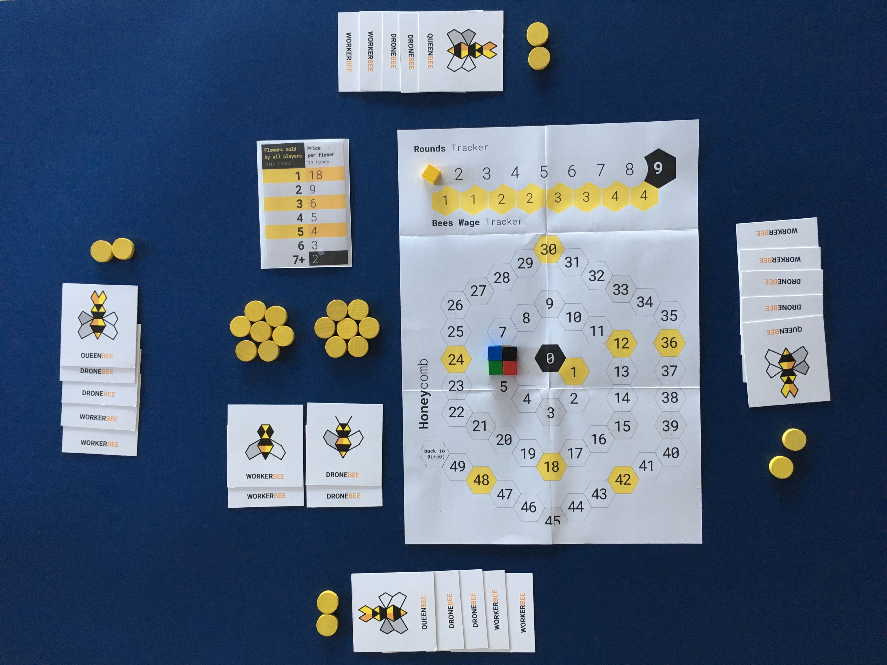

# Beesness v10

### Still trying to make more honey than anyone else, but you can play only one card per turn!

Type | Price | Action | Discard or keep?
---- | ----- | ------ | ----------------
**Worker**    | **1** honey | **Pick flowers** from the garden.  How many? `3  flowers` if you're the only one playing this card. Subtract 1 flower for each other player that also played this card. For example, if 2 players play the worker, they  can pick 2 flowers each. | Discard
**Drone**    | **2** honey | **Sell flowers**.  How many? Up to `3 flowers` if you're the only one playing this card. Subtract 1 flower for each other player that also played this card. For example, if 2 players play the drone, they can sell (up to) 2 flowers each in a *blind market* (same mechanics as the previous versions). | Discard
**Queen**    | / | **Hire bees**.  How many? Up to `3 bees` if you're the only one playing this card. Subtract 1 bee for each other player that also played this card. For example, if 2 players play the queen, they can hire (up to) 2 bees each (in an auction, if necessary). | Keep

### Setup

* **Flowers** (F): 36 in total. Place 28F in the garden and give 2F to each player.
* **Bees**: total 10 workers (W), 10 drones (D) and 4 queens (Q). Give 2W, 2D and 1Q to each player
* **Each player starts** with 2W, 2D, 1Q, 2F and 6H each.
* **9 rounds**.
* **Honeypot** = F left in the game (both garden and picked by players) + H invested in bees during the bee market (same as v8).
	* Honeypot starts at 36. 
	* When dividing the honeypot, always round up.

### Gameplay

* Cards in your hand are kept **secret**, and you play **one card per turn**.
* Decide which card to play, place it **face-down** on the table and when everyone is ready, **reveal your choices simultaneously**.
* When there are 2+ players going for the same action, the order of play is determined by how much honey they hold: **the player with the least honey goes first**. 

### Observations so far

* What if all 4 players play the same card? Well that's a missed turn for everyone, as they can't perform any action. For example, if all 4 players used the D on the same turn, with the D power starting at 3F and decreasing by 1F for each other player using the same card, then it would be `3 - 3 = 0`, ie nobody can sell any F.
* Predictably, the last round everyone wants to use their drones to sell out.. is there any other way to make this more interesting? Maybe get a *fixed amount* of H for each F you don't sell (my hunch is somewhere between 5 and 7 H).
* Get 1 extra H for each card left in your hand at the end? Or you can sell them back at face value (W = 1H, D = 2H)?
* Could *beesaster* / the referendum trigger some come-back mechanic? For example, if you trigger *beesaster* the players involved have to discard one card (either a D or a Q) and replenish the max number of flowers they could take with the worker.
* What if **the price of W & D bees grew with number of turns**? Starting at 1H in round 1 (both D and W) and growing by 1H at every round. That could balance the lowering number of F for the honeypot. It may also encourage players to use the Q early on as a long-term investment.
* The **honeypot** adds a nice variety to each round, but it also means some time is spent working out how to split it, both in players' heads and in practice. Try with a fixed-price flower market, like the 36H or the 18H *austerity* prices, and see if that makes a big difference.