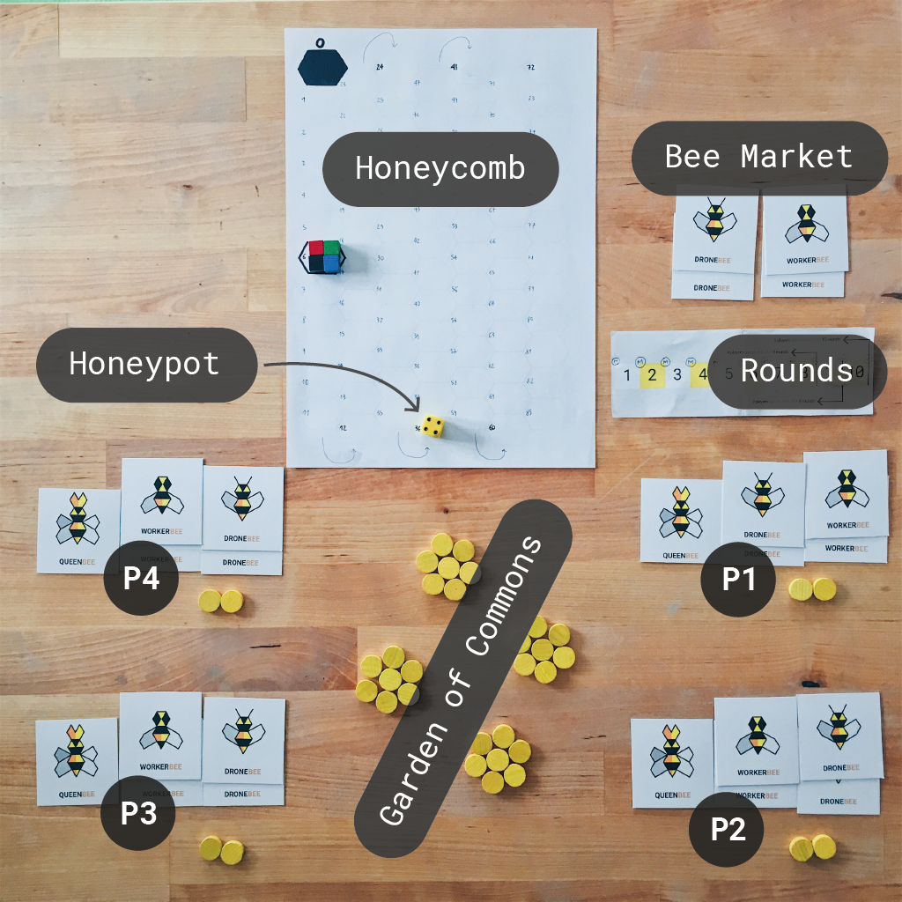

# Beesness v10

1. [Intro](#beesness-is-a-game-for-3-5-players-that-simulates-a-capitalist-market-economy)
2. [Setup](#how-to-beegin-setup)
3. [Gameplay](#how-to-beehave-gameplay)
4. [How to win](#how-to-win)
5. [FAQs](#sticky-situations-faqs) 

### **Beesness** is a game for 3-5 players that simulates a *capitalist market economy*. 

A *beesness* is a business for bees. 

Not your usual bees. In this game, bees have learned how to do business from us humans: they can **trade** flowers for honey and honey for more bees. 

**You** play the director of one beesness in times of *scarcity*. You compete against other players over **bees** (labour), **flowers** (resources) and **honey** (money). 

**To win**, your beesness must end the game with **more honey** than any other beesness.

# How to *beegin* setup

These instructions are for 4 players: P1, P2, P3 and P4. 

We're testing how to make this work for 3 and 5 players. Meanwhile, you can email your suggestions to matteo@beesness.games!

<!--  -->

### 1. Flowers

Flowers are the *natural resources* you can extract and sell. 

Plant **12 flower tokens** in the `Garden of Commons` which grows at the centre of the table. 

Give **2 flower tokens** to each player.

### 2. Bees

Bees are the *labour* you can employ.

You will need a total of **10 workers** (W), **10 drones** (D) and **4 queens** (Q).

Each player starts with 2W, 2D and 1Q.

Put the remaining 2W and 2D in the `Bee Market`.

Type | Action | Full-time or freelance?
---- | ------ | ----------------
**Worker**    | **Pick flowers** from the garden up to the *last round*. Gamble on honey in the *last round* (more on that later). | Freelance. This means you use it for one job. After that, the bee goes to the `Bee Market`, where it can be hired by you or other players.
**Drone**    | **Sell flowers** for honey. | Freelance
**Queen**    | **Hire bees** up to the *last round*. Cash in on other players' fortunes in the *last round*. | Full-time. This bee remains with you, it doesn't go to the `Bee Market` after a job.

### 3. Honey

Honey is *money*.

Each player picks a colour token and places it on the `Honeycomb` at 6. 

That means your initial capital is **6 honey**. 

### 4. Stalk Exchange

When you play a drone, you can sell flowers for honey.

The more flowers are sold, the less their individual value (aka *supply&demand*).

Total flowers sold  by all players | Honey per flower
------------------ | ----------------
1 | 18
2 | 9
3 | 6
4 | 5
5 | 4
6 | 3
7 - 13 | 2
14 + | 1

### 5. Rounds Tracker

This helps you keep track of the rounds. Put a marker over the first round.

There will be **9 rounds**.

### 6. Bees Wage Tracker

When you play the queen, you can invest your honey in hiring bees. Their starting price grows by 1 honey every 2 rounds.

# How to *beehave* gameplay 

The bee cards in your hand are kept **secret**, and you play **one card per round**.

Decide which card to play, place it **face-down** on the table and when everyone is ready, **reveal your choices simultaneously**.

You will carry out the chosen bee actions in this order:

1. Queens
2. Drones
3. Workers

When there are 2+ players going for the same bee, **the player with the least honey goes first**.

### 1. Queens
 
You can hire **3 bees** from the `Bee Market` if you're the only one playing the worker card. 
	
Subtract 1 bee for each other player that also played this card. 

> For example, if 2 players play the queen, they can hire (up to) 2 bees each. Also, if all players play the queen, nobody will be able to hire any bees. 

The **starting price** of every bee increments every 2 rounds, as indicated by the *Bees Wage Tracker*. Hiring bees becomes increasingly expensive as the game progresses.

When 2+ players want the same bee, they will enter an **auction** for it. The player with the least honey can start the auction. Players interested in that bee have to offer at least 1 honey more than the last offer. You may *beed* for only 1 bee at a time.

To **hire a bee**, subtract its price in honey from your counter on the `Honeycomb`.

> For example, you currently hold 9 honey and you're hiding a bee for 3 honey. Your counter goes down to 6.

### 2. Drones

You can trade (some of) your flowers for honey.

The flowers you trade will go back in the centre of the table, and the honey you gain from the trade will be added to your capital in the `Honeycomb`.

If two or more players chose the drone card, then they will enter a **blind bid**. Put the flowers you want to trade in your hand. Without revealing them, place your closed fist at the centre of the table (even if you're not trading any flowers). When everyone is ready, open your hands to show how many flowers you are trading. Count the flowers everyone is trading, and pay players off according to the `Stalk Exchange`.

> For example: you are selling 2 flowers and another player is selling 3. The total is 5 and according to the `Stalk Exchange` that means 4 honey per flower. So you get 8 honey and the other player 12. Move your counter on the `Honeycomb` 8 steps ahead and the other player's counter by 12 steps.
	
If you're the only one playing the drone card, then you get all the honey in the `Stalk Exchange` for just 1 flower! 

Drones are free-lance, so after you used one put it in the `Bee Market`.

### 3. Workers

You can pick **3 flowers** if you're the only one playing the worker card. 
	
Subtract 1 flower for each other player that also played this card. 
	
> For example, if 2 players play the worker, they can pick 2 flowers each. Also, if all players play the worker, nobody will get any flowers.

Workers are free-lance, so after you used one put it in the `Bee Market`. 

## Prepare the next round

Move the marker to the next space on the **round tracker**. 

## Last round!

Predictably, on the last round everyone would want to use a drone card and sell all their flowers to maximise their honey profits. There would be no point in picking flowers with a worker (there will be no chances to sell them after the game is over), or to hire more bees. 

However, the last round is special! 

1. **Queens become futures traders**: if you play your queen in the last round, you get **2 honey for each flower other players have** (banking on their fortunes).

	> For example: the total amount of flowers *other players* hold at the beginning of the last round is 7. By playing the queen, you get 14 honey (which you can add to your final score).
2. **Workers become gamblers**: if you play a worker card in the last round, then you get to **roll the die** as many times as you have flowers. You get as much honey for each roll as the die says.

	> For example: if you have 3 flowers, you get to roll the die 3 times and add each roll to your final honey score.
3. For the drones it's *beesness as usual*.  

# How to win

### At the end of the last round, **the player with the most honey wins!**

# Sticky situations FAQs   

1. **Do my bees count at the end of the game?**

	**No**. It's just the honey you have (that is, your *profits*) and not the overall *valuation* of your beesness. 
2. **Can I make alliances with other players?**

	Sure, why not? The terms of your trade agreements are up to you. 
3. **Can I lend honey to other players?** 

	Yas. As long as you trust them to pay their debt back...
4. **I'm in a rush, can we play a shorter game?** 

	Yep. You can shorten the game by playing less rounds. Keep in mind that in the last round queens and workers *beehave* differently!

## License

This work is licensed under a [Creative Commons Attribution-NonCommercial-ShareAlike 4.0 International License](http://creativecommons.org/licenses/by-nc-sa/4.0)

