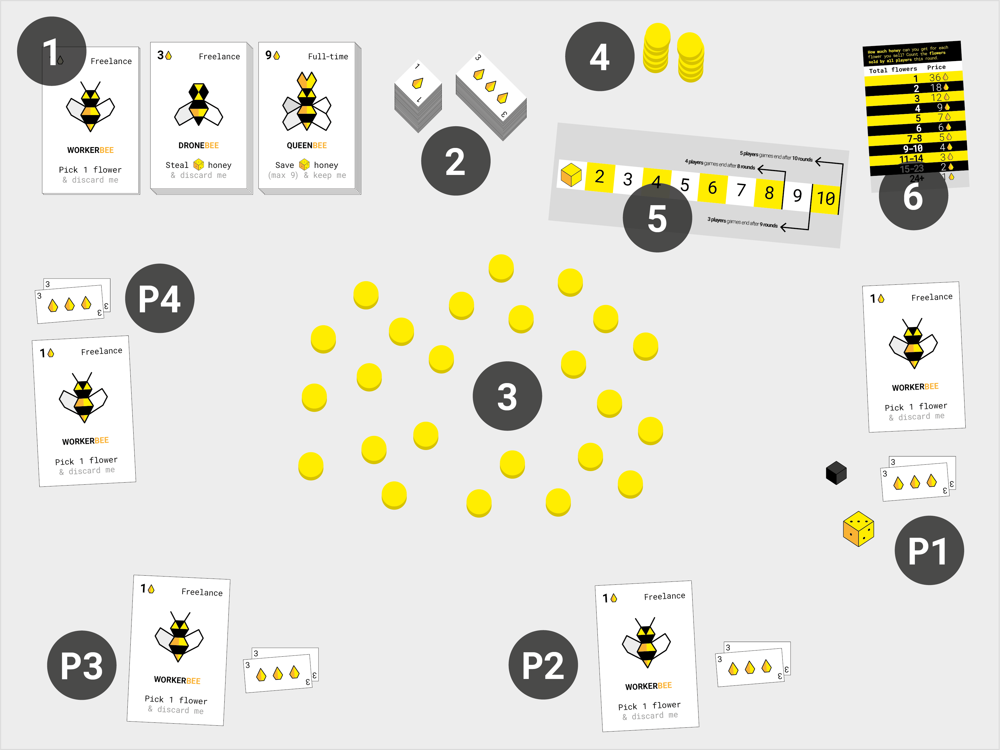
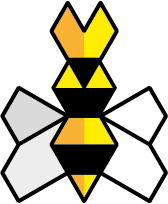

# Beesness v4.3

### **Beesness** is a game for 3-5 players that simulates a *capitalist market economy*. 

A *beesness* is a business for bees. 

Not your usual bees. In this game, bees have learned how to do business from us humans: they can *trade* flowers for honey and honey for more bees, and even *extort* honey from other beesnesses. 

**You** play the director of one beesness. You **compete** against other players over flowers (resources) and honey (money). 

**To win**, your beesness must end the game with **more honey** than any other beesness. 

Your beesness operates in the **garden of Commons**. If flowers run out, at any point during the game, **everybody loses** immediately! To avoid this tragedy, you can **trigger a referendum** to replant flowers.

Will you manage to maximise your honey profits while avoiding *drone strikes* and a collective *beesaster*?

# How to *beegin* setup

1. Make 3 stack of 6 **beesness cards** `1`, one for each bee type. That will be the *bee market*.

	Each player takes **1 worker** from the workers pile.
2. Stack all the **honey** `2` in two piles. That will be the *bank*. 

	Each player starts with **6 honey** and will be able invest some (or all) of it in bees, before the game begins.
3. The **garden of Commons** `3` grows at the centre of the table. *Plant* **6 flower tokens** for each player. 
4. Keep the rest of the flowers aside in the **unplanted flowers pile** `4`.
5. The **calendar** card `5` helps you keep track of the rounds. Place it next to the price chart. Put a **round marker** over the first round.
6. Put the flowers-honey **price chart** `6` next to the bank. 

You are now ready to play!

# How to *beehave* gameplay 

Let's start with some basic definitions: `rounds`, `phases`, `turns`...

A Beesness game lasts between **8 and 10 rounds**, depending on the number of players. 

There are **3 phases** for each round:

1. **Bees market**, when all players can *beed* in an auction to hire bees (one bee at a time).
2. **Your turn**, when you use your bees to execute your beesness plan (one player at a time).
3. **Flowers market**, when all players try to sell their flowers (simultaneously).

Decide who is going to be the **starting player**. Each player rolls the die, and whoever rolls the highest number will start.

You will **rotate the starting player**. If you started this round, the player to your left will start the next.

Play goes **clockwise** around the table. :alarm_clock: 

## Phase 1 - **Bees market**

### If you have enough honey and want to expand your beesness, **you can buy** one or more bees during this phase. 

* You may buy one bee at a time. 
* The player starting the next round takes the one bee s/he wants and declares `I want this {bee type} for {starting price}`. 
	* If nobody else wants it, then s/he can go ahead and buy it. 
	* Otherwise an **auction** for that bee starts: players interested in that bee have to offer at least 1 honey more than the last offer. 
* To buy a bee, pay the bank the price for it in honey and then add the card to your beesness. 
* Once the bee is sold, the market moves on to the next bee, with the player to the left of the previous one getting to choose the bee s/he wants and potentially starting another auction. This continues clockwise until nobody wants to buy any more bees.   

**You can sell** your bees back to the bank at 1/3 of their initial price. 

You can also **trade bees with other players**: see if anyone is interested in your bees and negotiate a price.

## Phase 2 - **Your turn**

### Use your cards to **execute your beesness plan** (2a). If flowers are running low, you can also trigger a **beesaster referendum** (2b) to replant the garden.

#### (2a) **Execute your beesness plan!**  

Every beesness card has a skill. Use as many of your cards as you like. 
	
> For example: you have 2 workers, 1 drone and 1 queen.  You could pick 2 flowers (1 flower each) with your 2 workers, then try and steal some honey from another beesness with your drone, and put some of the loot in your *savings* with the queen.

#### (2b) **Trigger a beesaster referendum!** 

Remember, should the flowers run out at any point during the game, then everybody would lose immediately. Game over! 

To avoid this *beesaster* (and to prevent other players from killing the game by taking the last few flowers) you can **call a vote to replenish the garden** during your turn.

`Are you willing to discard one of your bees in exchange for 2 new flowers?` 

Reveal your choice at the same time as everyone else using your hand: *closed fist* :facepunch: means you are unwilling to discard bees (voting **No**), *thumb up* :thumbsup: means you are voting **Yes**.

**You get 1 vote for each of your bees**. For example, if you have a total of 5 bees, you get 5 votes.

* If there's a **majority of Yes** votes then *each* player will discard one of their beesness cards and add 2 new flowers to the garden. For example, in a 4-player game you would add 8 new flowers to the garden.
* Otherwise, no flowers are replanted this turn.

## Phase 3 - **Flowers market**

### When all players have executed their *beesness plans*, the bank opens the *stalk exchange* and you have 1 minute to trade your flowers for honey. Then you will move to the next round.

#### **Trade flowers on the stalk exchange!**

You have 1 minute to decide how many of your flowers to put on the *stalk exchange*. **Everybody does this at the same time**.
	
You could get between `no honey` and `a lot of honey` for each flower you trade. Their price will depend on how many flowers are traded on the stalk exchange by all players. The more flowers, the less they are worth (a.k.a. [*supply&demand*](https://en.wikipedia.org/wiki/Supply_and_demand)).
	
Put the flowers you want to trade (from none to all) in your hand. Without revealing them, place your closed fist at the centre of the table. When everyone is ready, open your hands to show how many flowers you are trading.

Check the **price chart** to determine the **price of one flower**.
 
You get paid in honey, from the bank, for the flowers you are trading. 
	
> For example: if you are trading 2 flowers and their individual price is 9 honey, you get 18 honey from the bank.

Your flowers are now sold. Put them back onto the *unplanted flowers pile*.

#### Move the die to the next space on the **calendar** to keep track of the rounds.

# Meet the bees

Type | Price | Action | Discard or keep?
---- | ----- | ------ | ----------------
**Worker**    | **1** honey | **Pick 1 flower** from the garden. | Discard
**Drone**    | **3** honey | Roll the die and then **steal as much honey as the die says** from another beesness. | Discard
**Queen**    | **9** honey | Roll the die and then **save as much honey as the die says up to a maximum of 9 honey**. This means that drones won't be able to steal that honey. Place the saved honey on top of your Queen card. | Keep	

# How to win

### At the end of the last round, **the player with the most honey wins!**

# How not to lose

### If flowers run out, at any point during the game, everybody loses *immediately*.

To avoid this *beesaster* (and to prevent other players from killing the game by taking the last flowers) you can **call a vote to replenish the garden** during your turn.

`Are you willing to discard one of your bees in exchange for 2 new flowers?` 

**You get 1 vote for each of your bees**. For example, if you have a total of 5 bees, you get 5 votes.

* If there's a **majority of Yes** votes then *each* player will discard one of their beesness cards and add 2 new flowers to the garden. For example, in a 4-player game you would add 8 new flowers to the garden.
* Otherwise, no flowers are replanted this turn.

# Sticky situations FAQs   

1. **Do my bees count at the end of the game?**

	**No**. It's just the honey you have (that is, your *profits*) and not the overall *valuation* of your beesness. 
2. **Can I make alliances with other players?**

	Sure, why not? The terms of your trade agreements are up to you. 
3. **What if I use my drone(s) against a beesness that has not enough honey?**

	You can only get as much honey as they have available (you cannot steal the honey saved onto queens).
4. **Can I use a drone and buy more beesness cards with the loot?**

	Not during the same turn. You'll have to wait the end of the round to invest your loot into new beesness cards.
5. **Can I lend honey to other players?** 

	Yas. As long as you trust them to pay their debt back...
6. **I'm in a rush, can we play a shorter game?** 

	Yep. You can play a game of 3 rounds (3 players), 4 rounds (4 players) or 5 rounds (5 players). Same rules as the longer games, except that you start with 3 flowers per player instead of 6.

## License

This work is licensed under a [Creative Commons Attribution-NonCommercial-ShareAlike 4.0 International License](http://creativecommons.org/licenses/by-nc-sa/4.0)

