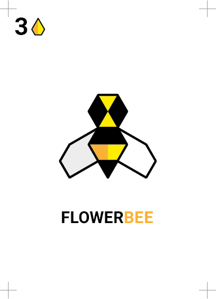
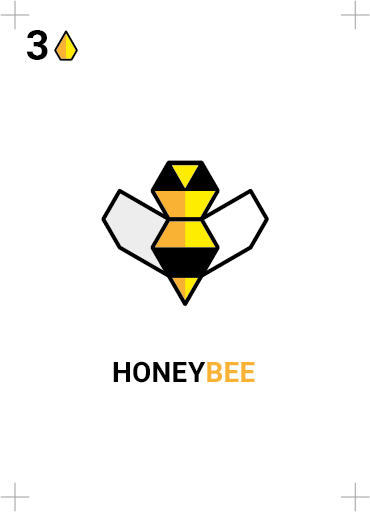
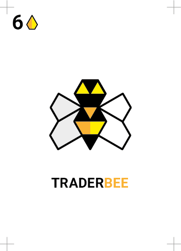
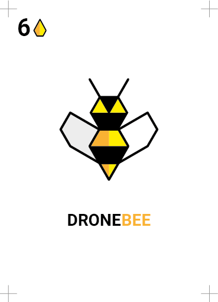
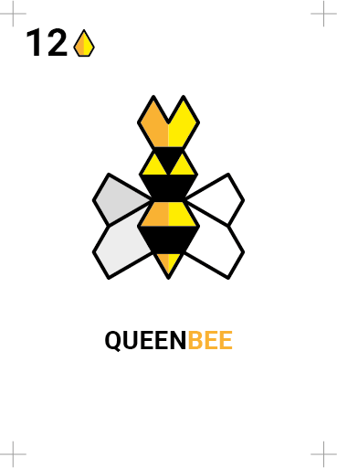

### The problem(s)

1. **Allegory**
	
	Some kids seemed to have an issue with the flower/honey trade: *bees don't sell flowers to buy honey, they make honey*. They definitely have a point. I think if the bees allegory maps reality (or what people know about real bees) more closely, then players will find it easier to remember the game rules, because they will *make sense*. 
2. **Broken mechanic**

	There's something broken in having to wait for everyone to complete their actions and only then being able to trade flowers for honey. Ideally, you play your turn and then you're done.
3. **One action per turn**

	In many other board games players can execute one action per turn, while Beesness so far has been more on the `do as much as you like` side, which has led to various edge cases.
4. **Free market**?

	At the moment, you can only trade flowers for honey (not the other way around) and honey for bees (not the other way around). Why? It doesn't make much sense, and it limits player's choices. 
	
### A potential solution?

Federico has been suggesting to include **honey** bees for a while. So I did, and while carrying out that thought experiment, I realised that another type of bee could be help nail the problems above. Instead of trading stuff as a separate action at the end of each round, there could be a specialised type of bee that does that: meet the **trader** bee. Its job is to buy and sell the colony's flowers (taken by the workers) or honey (produced by the honey bees). 

#### Bee cards

Name | Price | Skills (per turn)
---- | ----- | ------
Flower bee     | 3 | It can take 1 flower from the garden
Honey bee     | 3 | It can convert 1 flower into 2 honey (take 2 honey from the bank and discard the flower)
Trader bee     | 6 | It can trade 1 flower for honey, or viceversa at the current market price (see chart below)
Drone bee     | 6 | It can steal honey at the current market price (see chart below)
Queen     | 12 | It can generate one other bee (but not other queens) 

The trader bee sounds like a useful card, but how do you determine the market prices for flowers and honey (ideally in a way that doesn't require waiting for the end of the round)? 

The basic idea is that when flowers are cheap, honey is expensive, and when flowers go up in price, honey becomes cheap. Sort-of supply&demand. 

There are several possible price ratios in this commodity market:

Flowers | Honey
------- | -----
3 | 1
2 | 1
1 | 1
**1** | **2**
1 | 3
1 | 4
1 | 5

At the top cheap flowers. In the first case you get 3 flowers for 1 honey. Towards the bottom flowers become more expensive (and honey cheapens), so that in the last row you can trade 1 flower for 5 honey. 

The game starts with a `1 : 2` ratio (1 flower gets you 2 honey, same ratio as the honey bee).    

With `one-action-per-turn` and the *trader* bee, we could have a routine like this, for each turn:
 
1. Buy bee cards (same as v4)
2. Do your **bee-action**, using only one type of bees. For instance, you can take flowers with your workers, or trade honey for flowers using your trader(s), but not both in the same turn.

	When using traders, refer to the current `flower : honey` ratio to work out prices. That starts with a `1 : 2` ratio. 
3.	At the end of your turn you move it up or down one step, according to the bee-action you performed:
	
	* If you used **flower** bees to take flowers, then flowers will become cheaper (eg from `1 : 2` to `1 : 1`). Move the ratio indicator *up*.
	* If you used **honey** bees to make honey, then honey will become cheaper (eg from `1 : 2` to `1 : 3`). Move the ratio indicator *down*.
	* If you used **drone** bees or the **queen**, the ratio will not change.
	* If you used the **trader** bee: when you buy flowers, they will become cheaper because there are more flowers and less honey on the market (move the ratio indicator *up*). Likewise honey will become cheaper after you buy some of it (move the ratio indicator *down*).

Your bee-action will therefore affect the flower/honey price for the player(s) after you. Ratios will keep fluctuating, making trade hopefully more interesting.

The honey bee is not just for semantic reasons, but it also gives players a new set of strategic choices. Now with both honey and flowers being commodities on the market, you can choose which one to concentrate your actions on, and in which proportion.

At the end of a round, the player who will start the next round takes care of replanting the garden (1 flower per player).