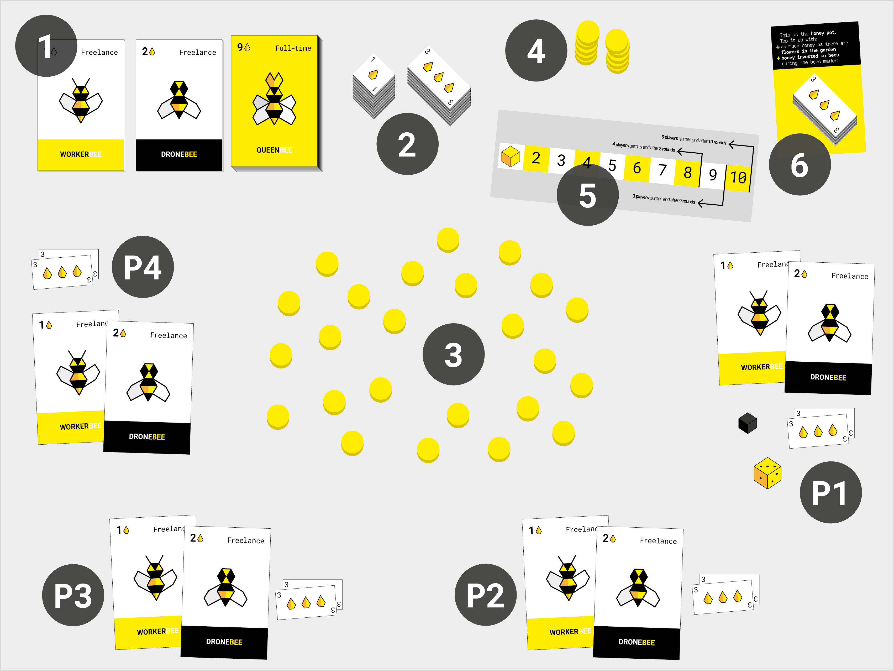
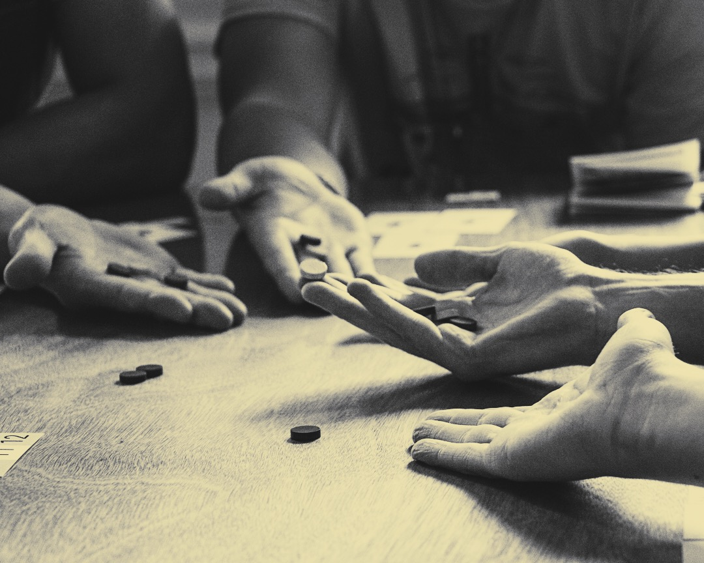

# Beesness v8

### **Beesness** is a game for 3-5 players that simulates a *capitalist market economy*. 

A *beesness* is a business for bees. 

Not your usual bees. In this game, bees have learned how to do business from us humans: they can **trade** flowers for honey and honey for more bees. 

**You** play the director of one beesness in times of *scarcity*. You **compete** against other players over bees (labour), flowers (resources) and honey (money). 

**To win**, your beesness must end the game with **more honey** than any other beesness. 
 
Your beesness operates in the **garden of Commons**. If its flowers run out, at any point during the game, **everybody loses** immediately! You can avoid this tragedy by **calling a referendum** to replant flowers.

Will you manage to maximise your honey profits while preventing a collective *beesaster*?

# How to *beegin* setup

1. Make 3 stacks of 6 **beesness cards** `1`, one stack for each bee type. That will be the *bee market*.

	Each player takes **1 worker** from the workers stack and **1 drone** from the drones stack.
2. Stack **72 honey** `2` in two piles. That will be the *bank*, but unlike your standard central bank this won't generate any more honey. 72 is all there is. 

	Each player starts with **6 honey** and will be able invest some (or all) of it in bees, before the game begins.
3. The **garden of Commons** `3` grows at the centre of the table. *Plant* **6 flower tokens** for each player. 
4. Keep the rest of the flowers aside in the **unplanted flowers pile** `4`.
5. The **calendar** card `5` helps you keep track of the rounds. Place it next to the bank. Put a **marker** over the first round.
6. Put the **honey pot** card `6` next to the calendar. 

	Top it up with **as much honey as there are flowers in the garden**. For example, if there are 24 flowers in the garden, take 24 honey from the bank and put them in the honey pot. 

You are now ready to play!
	

# How to *beehave* gameplay 

Let's start with some basic definitions: `rounds`, `phases`, `turns`...

A Beesness game lasts between **8 and 10 rounds**, depending on the number of players. 

There are **3 phases** for each round:

1. **Bees market**, when all players can *beed* in an auction to hire bees (one bee at a time).
2. **Your turn**, when you use your bees to execute your beesness plan (one player at a time).
3. **Flowers market**, when all players try to sell their flowers (simultaneously).

Decide who is going to be the **starting player**. Each player rolls the die, and whoever rolls the highest number will start.

You will **rotate the starting player**. If you started this round, the player to your left will start the next.

Play goes **clockwise** around the table. :alarm_clock: 

## Meet the bees

Type | Price | Action | Discard or keep?
---- | ----- | ------ | ----------------
**Worker**    | **1** honey | **Pick 1 flower** from the garden during your turn. | Discard
**Drone**    | **2** honey | **Sell up to 2 flowers** during the flower market. | Discard
**Queen**    | **9** honey | **Generate 1 bee** (either a worker or a drone) during your turn. | Keep

## Phase 1 - **Bees market**

### If you have enough honey and want to expand your beesness, **you can hire** one or more bees during this phase. 

1. Make sure the honey pot is topped up with **as much honey as there are flowers in the garden**. 
2. You may hire one bee at a time. 
3. The *starting player* takes the one bee she wants and declares `I want this {bee type} for {starting price}`. 
	* If nobody else wants it, then she can go ahead and hire it. 
	* Otherwise an **auction** for that bee starts: players interested in that bee have to offer at least 1 honey more than the last offer. 
4. To **hire a bee**, pay its price in honey into the **honey pot** and then add the card to your beesness. 
5. Once the bee is sold, the market moves on to the next bee, with the player to the left of the *starting player* getting to choose the bee s/he wants and potentially starting another auction. 
6. This continues clockwise until nobody wants to hire any more bees.   

<!-- **You can sell** your bees back to the bank at 1/3 of their initial price. -->

You can **trade bees with other players**: see if anyone is interested in your bee(s) and negotiate a price.

## Phase 2 - **Your turn**

### Use your cards to **execute your beesness plan** (2a). If flowers are running low, you can also trigger a **beesaster referendum** (2b) to replant the garden.

#### (2a) **Execute your beesness plan!**  

Every beesness card has a skill. Use as many of your cards as you like. 
	
> For example: you have 1 worker, 1 drone and 1 queen.  You could start by generating an extra worker with your queen. You now have 2 workers, so you can pick 2 flowers (1 flower each). At the end of the round, during the flower market, you'll be able to sell those 2 flowers with your drone.

#### (2b) **Trigger a beesaster referendum!** 

Remember, should the flowers run out at any point during the game, then everybody would lose immediately. Game over! 

To avoid this *beesaster* (and to prevent other players from killing the game by taking the last flower) you can **call a vote to replenish the garden** during your turn.

`Are you willing to discard one of your bees in exchange for 2 new flowers?` 

Reveal your choice at the same time as everyone else using your hand: *closed fist* :facepunch: means you are unwilling to discard bees (voting **No**), *thumb up* :thumbsup: means you are voting **Yes**.

**You get 1 vote for each of your bees**. For example, if you have a total of 5 bees, you get 5 votes.

* If there's a **majority of Yes** votes then *each* player will discard one of their beesness cards and add 2 new flowers to the garden. For example, in a 4-player game you would add 8 new flowers to the garden.
* Otherwise, no flowers are replanted this turn.

## Phase 3 - **Flowers market**

### When all players have executed their *beesness plans*, the bank opens the *stalk exchange* and you have 1 minute to trade your flowers for honey. Then you will move to the next round.

#### **Trade flowers on the stalk exchange!**

Everybody does this at the same time:

1. You can trade **up to 2 flowers for each drone** you employ. Decide how many flowers you want to trade.

	> For example: you have 3 flowers and 1 drone. You can trade up to 2 flowers, but you decide to trade none of them this time around. 
2. Put the flowers you want to trade in your hand. Without revealing them, place your closed fist at the centre of the table (even if you're not trading any flowers). When everyone is ready, open your hands to show how many flowers you are trading.

	
3. Count the flowers everybody is trading, and divide the honeypot accordingly. Round the number up if the division is not a whole number.

	> For example: the honeypot contains 30 honey and the total number of flowers traded is 6. Each flower will be worth 5 honey (30/6). Let's say you are trading 2 of those 6 flowers, so you get 10 honey from the honeypot.
4. Discard all the traded flowers onto the *unplanted flowers pile*. 

<!-- (never put them back in the garden). -->

#### Move the marker to the next space on the **calendar** to keep track of the rounds.

# How to win

### At the end of the last round, **the player with the most honey wins!**

# How not to lose

### If flowers run out, at any point during the game, everybody loses *immediately*.

To avoid this *beesaster* (and to prevent other players from killing the game by taking the last flower) you can **call a vote to replenish the garden** during your turn.

`Are you willing to discard one of your bees in exchange for 2 new flowers?` 

**You get 1 vote for each of your bees**. For example, if you have a total of 5 bees, you get 5 votes.

* If there's a **majority of Yes** votes then *each* player will discard one of their beesness cards and add 2 new flowers to the garden. For example, in a 4-player game you would add 8 new flowers to the garden.
* Otherwise, no flowers are replanted this turn.

# Sticky situations FAQs   

1. **Do my bees count at the end of the game?**

	**No**. It's just the honey you have (that is, your *profits*) and not the overall *valuation* of your beesness. 
2. **Can I make alliances with other players?**

	Sure, why not? The terms of your trade agreements are up to you. 
3. **Can I lend honey to other players?** 

	Yas. As long as you trust them to pay their debt back...
4. **I'm in a rush, can we play a shorter game?** 

	Yep. You can play a game of 3 rounds (3 players), 4 rounds (4 players) or 5 rounds (5 players). Same rules as the longer games, except that you start with 3 flowers per player instead of 6.

## License

This work is licensed under a [Creative Commons Attribution-NonCommercial-ShareAlike 4.0 International License](http://creativecommons.org/licenses/by-nc-sa/4.0)

