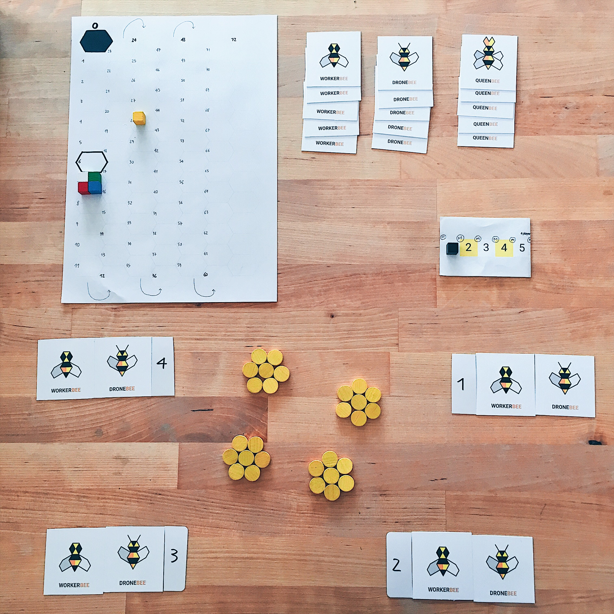

# v8.2

Like [v8](README.md), but:

* Bees total: 9W, 9D, 5Q (5 cards per bee type, plus the extra W+D that each player starts with).
* Each player starts with 1W, 1D and 7H.
* D can sell 1F.
* Garden starts with 7F per player, organised as a hex.
* Replant 1F for every 7F left.
* **NEW** incentive to keep F: flowers that are not sold on the market can be cashed in at a fixed 7H.
* No need for a 2-step flower market after the last round.
* **NEW** *comeback mechanic*. Order of play is determined by H held: the player with the smallest amount of honey goes first, second is the player with the second smallest amount, etc. This happens twice every round:
	
	1. Before the bee market starts.
	2. Before the flower harvesting starts.
* Potential extra *comeback mechanic*: before the bee market starts, each player gets as much extra H as the number of players in front of her (eg: in a game of 4, the last player gets 3H, the next to last 2, etc.) 

Differences with v8.1 (some may be same as v8):

* No limits on auctions.
* Bees generated by Q can be used immediately.
* **Honeypot** = F left in the garden + H invested in bees during the bee market (same as v8)

